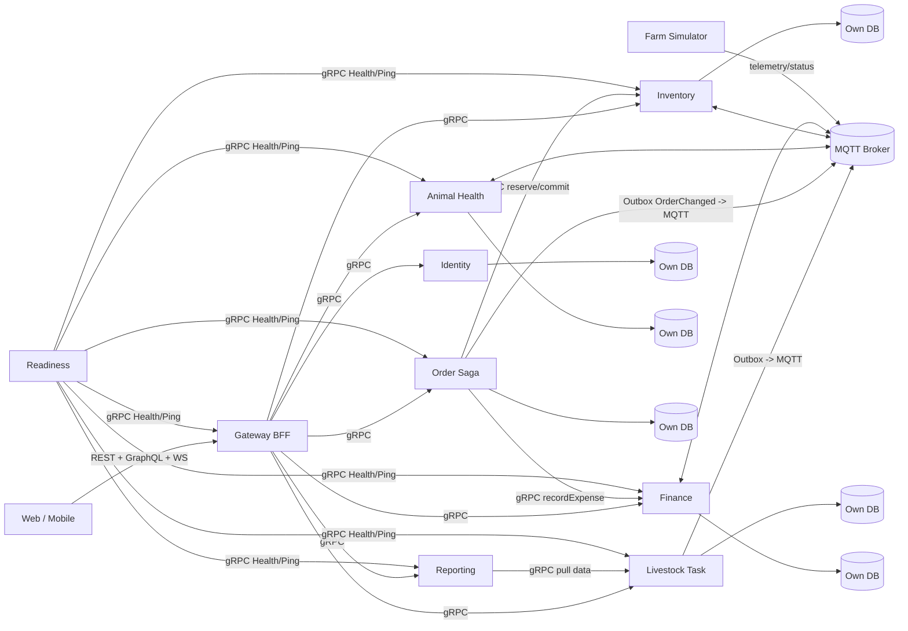

# Kiến trúc khởi tạo SmartFarm

## 1. Quyết định nền

- Java 17, Spring Boot 4.1.1, Spring gRPC 1.1.1, package gốc `com.htv.smartfarm`.
- Maven monorepo: root `pom.xml` vừa là parent POM (module kế thừa cấu hình chung) vừa là reactor aggregator. Dependency
  Java nội bộ dùng tọa độ `com.htv.smartfarm:*` theo `${project.version}`; Maven Reactor build dependency nội bộ theo
  đúng thứ tự trong cùng một cây nguồn.
- Đồng bộ: gRPC cho command/query nội bộ có payload lớn hoặc cần độ trễ thấp.
- Bất đồng bộ: MQTT cho domain integration event, trạng thái quy trình và telemetry IoT. MQTT không thay thế database
  transaction.
- Client chỉ đi qua Gateway bằng REST/GraphQL. Không công khai gRPC service ra Internet trong giai đoạn đầu.

## 2. Thành phần và ràng buộc

**Không chia sẻ bảng giữa service.** Common module chỉ chứa contract, primitives và starter kỹ thuật, không chứa entity
JPA/domain nghiệp vụ của service khác.

## 3. Transaction phân tán

Chọn **Saga choreography + Transactional Outbox + idempotent consumer**, không dùng 2PC/XA. Mỗi command cập nhật
aggregate và ghi outbox trong cùng local transaction. Relay phát MQTT với `eventId`, `correlationId`, `aggregateId`,
`schemaVersion`. Consumer lưu inbox/dedup trước khi áp dụng tác động. Khi bước sau thất bại, phát compensation
command/event rõ nghĩa.

Trạng thái mẫu: `ORDER_CREATED -> INVENTORY_RESERVED -> TASK_SCHEDULED -> FINANCE_POSTED -> COMPLETED`; nhánh lỗi phát
`*_FAILED` và compensation.

## 4. Security

Khuyến nghị OAuth 2.1/OIDC với Authorization Server riêng và JWT ký bất đối xứng:

- Mặc định: **EdDSA/Ed25519** nếu toàn bộ IdP, gateway và thư viện JOSE hỗ trợ đồng nhất; khóa nhỏ, ký/xác minh nhanh.
- Phương án tương thích rộng: **RS256**. Nếu tổ chức đã chuẩn hóa elliptic curve, dùng **ES256**.
- Không dùng shared-secret HS256 giữa nhiều service vì việc phát tán secret biến mọi verifier thành signer.
- JWT access token ngắn hạn 5-15 phút, có `iss`, `sub`, `aud`, `exp`, `nbf`, `jti`, `scope/roles`, `tenant_id`; publish
  public keys qua JWKS, hỗ trợ `kid` và rotation.
- Gateway xác thực client; từng service vẫn verify token hoặc service token, không chỉ tin gateway. Starter chỉ mở truy
  cập cho profile `dev` để smoke test; profile `prod` phải có issuer/JWKS và chính sách authorize trước khi chạy.

## 5. gRPC interceptors và thứ tự

Server chain đề xuất: correlation (10), authentication (20), authorization (30), rate-limit (40), validation (50),
metrics/tracing (60), exception mapping (90). Client chain: correlation propagation, service credential, deadline, retry
chỉ cho RPC idempotent, metrics.

Metadata chuẩn: `authorization`, `x-correlation-id`, `x-tenant-id`, `x-request-id`. Deadline bắt buộc theo use case.
Không retry command không idempotent nếu thiếu idempotency key.

## 6. TLS

- `dev`: plaintext mặc định để debug cục bộ; profile `dev-tls` (identity) dùng certificate development.
- `prod`: yêu cầu TLS; nội bộ nâng lên mTLS khi có PKI/service mesh. Private key không commit Git.
- **Trạng thái v1**: `smartfarm.grpc.tls.enabled=false` là feature-switch (một số service như finance đã có
  cert-chain/private-key placeholder trong cấu hình), **nhưng binding vào Netty server/channel transport chưa được
  bật** — đây là hạng mục **v2 hardening** (bind customizer + mTLS + test TLS). gRPC nội bộ v1 chạy plaintext trên
  loopback; bảo mật hiện dựa vào single-ingress qua gateway + per-service token (zero-trust) + audit `actor_id`.

## 7. Dữ liệu

`dev` dùng H2 PostgreSQL compatibility mode để chạy nhanh. `prod` dùng PostgreSQL. Migration phải đi qua Flyway và được
test thêm bằng Testcontainers PostgreSQL, vì H2 không tương đương PostgreSQL về type, lock và SQL dialect.
