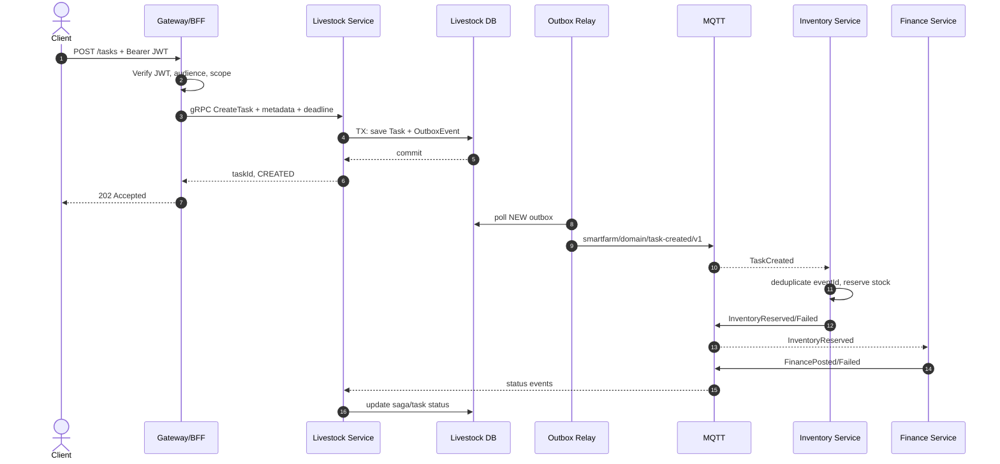
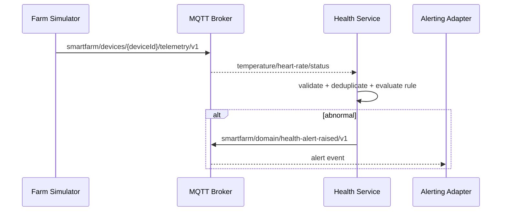
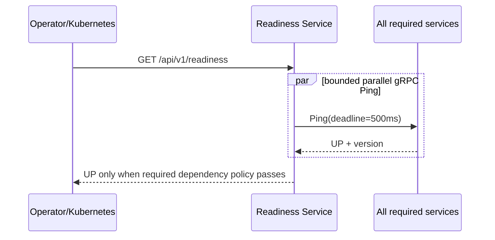

# Sequence tổng quát

## Command tạo nhiệm vụ và saga

```mermaid
sequenceDiagram
  autonumber
  actor Client
  participant GW as Gateway/BFF
  participant LS as Livestock Service
  participant DB as Livestock DB
  participant OB as Outbox Relay
  participant MQ as MQTT
  participant IV as Inventory Service
  participant FN as Finance Service
  Client->>GW: POST /tasks + Bearer JWT
  GW->>GW: Verify JWT, audience, scope
  GW->>LS: gRPC CreateTask + metadata + deadline
  LS->>DB: TX: save Task + OutboxEvent
  DB-->>LS: commit
  LS-->>GW: taskId, CREATED
  GW-->>Client: 202 Accepted
  OB->>DB: poll NEW outbox
  OB->>MQ: smartfarm/domain/task-created/v1
  MQ-->>IV: TaskCreated
  IV->>IV: deduplicate eventId, reserve stock
  IV->>MQ: InventoryReserved/Failed
  MQ-->>FN: InventoryReserved
  FN->>MQ: FinancePosted/Failed
  MQ-->>LS: status events
  LS->>DB: update saga/task status
```

## IoT simulator

```mermaid
sequenceDiagram
  participant SIM as Farm Simulator
  participant MQ as MQTT Broker
  participant H as Health Service
  participant A as Alerting Adapter
  SIM->>MQ: smartfarm/devices/{deviceId}/telemetry/v1
  MQ-->>H: temperature/heart-rate/status
  H->>H: validate + deduplicate + evaluate rule
  alt abnormal
    H->>MQ: smartfarm/domain/health-alert-raised/v1
    MQ-->>A: alert event
  end
```

## Readiness

```mermaid
sequenceDiagram
  participant OPS as Operator/Kubernetes
  participant R as Readiness Service
  participant S as All required services
  OPS->>R: GET /api/v1/readiness
  par bounded parallel gRPC Ping
    R->>S: Ping(deadline=500ms)
    S-->>R: UP + version
  end
  R-->>OPS: UP only when required dependency policy passes
```
