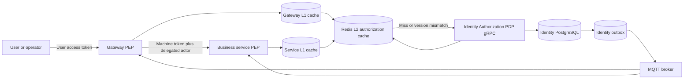

<!-- GENERATED BY generate_dynamic_authorization_design_docs.py; REVIEW-ONLY DESIGN -->

# 1. Target Architecture

## 1.1 Current problem

The current model couples business permissions to static application configuration:

```text
API adds SCOPE_x
  -> update KNOWN_SCOPES
  -> update Identity YAML
  -> update Gateway service-token scopes
  -> restart Identity/Gateway/services
```

This causes drift, delayed revocation, deployment coupling, and accidental catalog pollution from source scanning.

## 1.2 Target context



## 1.3 Responsibility boundaries

### Authentication

Authentication remains local to each resource server:

- Verify JWT signature, issuer, expiry, not-before, audience, token type, tenant, and client ID.
- Extract user subject or delegated actor.
- Never call Identity merely to validate a valid signed token.

### Machine authorization

Machine authorization answers:

```text
May gateway invoke smartfarm-order?
May order invoke smartfarm-inventory?
```

Machine tokens use stable technical permissions, for example:

```text
service:order:invoke
service:inventory:invoke
```

They never carry `*` and do not carry the complete list of user-facing business permissions.

### Business authorization

Business authorization answers:

```text
May subject user-001 perform orders:saga:admin in tenant-001 on saga-789?
```

This decision is evaluated dynamically by Identity or returned from a version-safe cache.

## 1.4 Core decision model

```text
Decision = f(
  tenant,
  subject,
  permission,
  resource,
  account state,
  tenant state,
  membership state,
  role grants,
  farm/resource scope,
  catalog version,
  tenant version,
  subject version
)
```

The PDP returns:

```text
allowed
reasonCode
decisionId
catalogVersion
tenantVersion
subjectVersion
cacheTtlSeconds
evaluatedAt
```

## 1.5 Super Admin semantics

The protected `SUPERADMIN` role owns the protected permission `*`.

Rules:

1. The wildcard is valid only for a user authorization context.
2. A service token can never contain or acquire wildcard semantics.
3. Wildcard bypasses business permission and tenant-local resource scope checks.
4. Wildcard does not bypass token validation, tenant resolution, account status, or explicit platform boundary protections.
5. Identity returns `ALLOWED_BY_SUPERADMIN`; services do not expand `*` into every known permission.

## 1.6 Delegated actor

A downstream service authenticates the service client and separately identifies the original user actor.

Recommended service-token claims:

```json
{
  "sub": "svc:gateway",
  "client_id": "gateway",
  "token_type": "service",
  "tenant_id": "tenant-001",
  "aud": ["smartfarm-order"],
  "act": {
    "sub": "user-001",
    "authorization_version": 42
  }
}
```

`RequestContext.actor_id` remains for audit and compatibility, but it must match `act.sub`. A mismatch is denied.

## 1.7 Shared library structure

```text
libs/smartfarm-authorization/
└── src/main/java/com/htv/smartfarm/authorization/
    ├── api/
    │   ├── AuthorizationRequest.java
    │   ├── AuthorizationDecision.java
    │   ├── AuthorizationResource.java
    │   ├── AuthorizationVersions.java
    │   └── AuthorizationReason.java
    ├── client/
    │   ├── AuthorizationDecisionClient.java
    │   ├── GrpcAuthorizationDecisionClient.java
    │   └── BatchAuthorizationDecisionClient.java
    ├── cache/
    │   ├── AuthorizationCache.java
    │   ├── CompositeAuthorizationCache.java
    │   ├── LocalAuthorizationCache.java
    │   ├── RedisAuthorizationCache.java
    │   ├── AuthorizationCacheKey.java
    │   └── AuthorizationVersionStore.java
    ├── invalidation/
    │   ├── AuthorizationInvalidationHandler.java
    │   ├── AuthorizationInvalidationSubscriber.java
    │   └── AuthorizationVersionTracker.java
    ├── spring/
    │   ├── SmartFarmAuthorizationManager.java
    │   ├── SmartFarmReactiveAuthorizationManager.java
    │   ├── SmartFarmMethodAuthorizationManager.java
    │   └── SmartFarmAuthorizationAutoConfiguration.java
    ├── grpc/
    │   ├── DynamicGrpcAuthorizationInterceptor.java
    │   ├── GrpcAuthorizationPolicy.java
    │   └── GrpcPermissionResolver.java
    ├── annotation/
    │   ├── RequirePermission.java
    │   └── RequireAnyPermission.java
    └── observability/
        ├── AuthorizationMetrics.java
        └── AuthorizationAuditLogger.java
```

## 1.8 Permission declaration and registration

The owning service declares permissions near its API, then generates a descriptor:

```yaml
service: smartfarm-order-service
namespace: orders
permissions:
  - code: orders:saga:read
    resource-type: orders-saga
    action: read
    description: View Order Saga progress
  - code: orders:saga:admin
    resource-type: orders-saga
    action: admin
    description: Operate Order Saga recovery
```

At startup, the library registers the descriptor with Identity using `RegisterPermissionDefinitions`. Registration upserts metadata but never grants the permission to a role.

## 1.9 API usage proposal

```java
@RequirePermission("orders:saga:read")
public OrderSagaView getByOrder(String orderId) {
    // business logic
}
```

Resource-aware check:

```java
@RequirePermission(
    value = "orders:read",
    resourceType = "ORDER",
    resourceId = "#orderId"
)
public OrderView getOrder(String orderId) {
    // business logic
}
```

The annotation is a PEP declaration. Identity remains the PDP.
