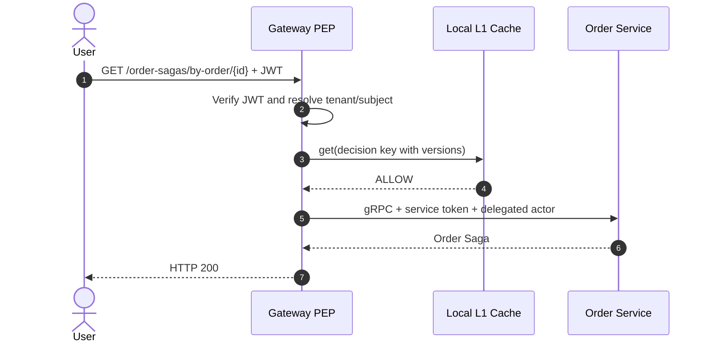
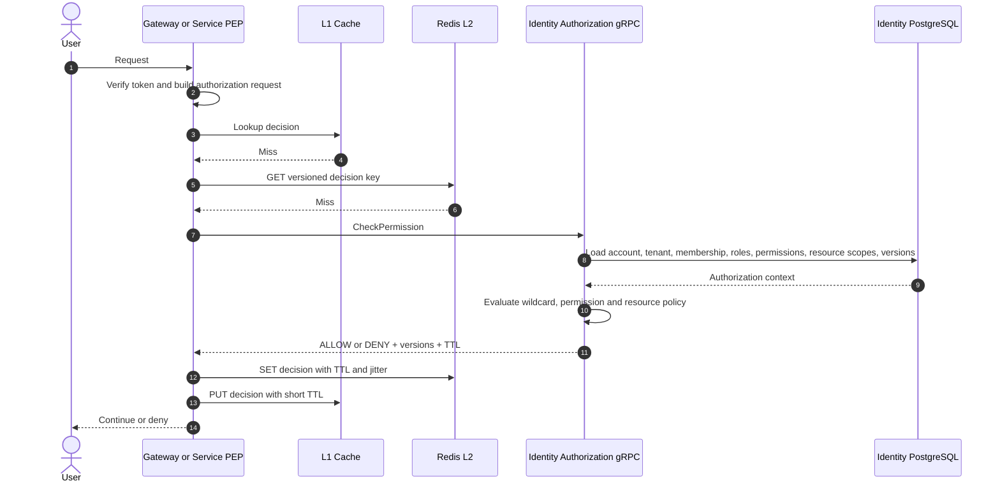
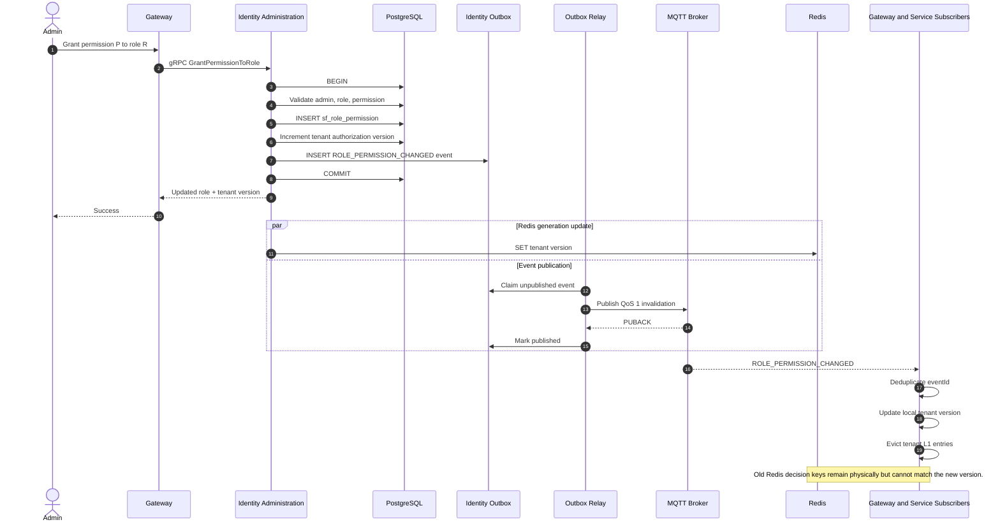
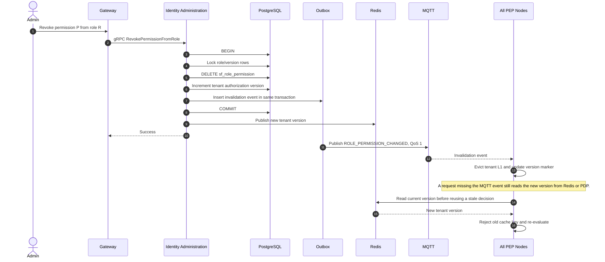
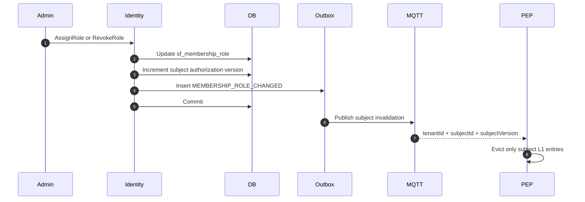
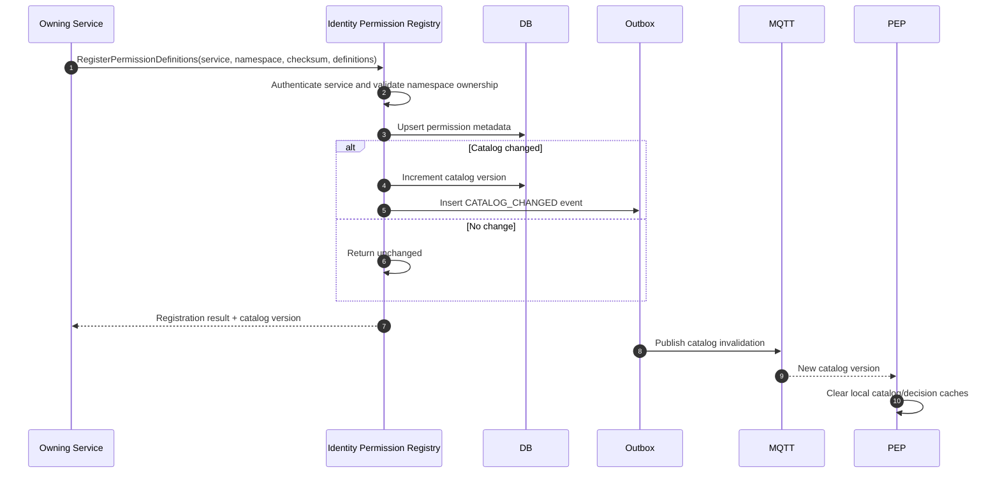
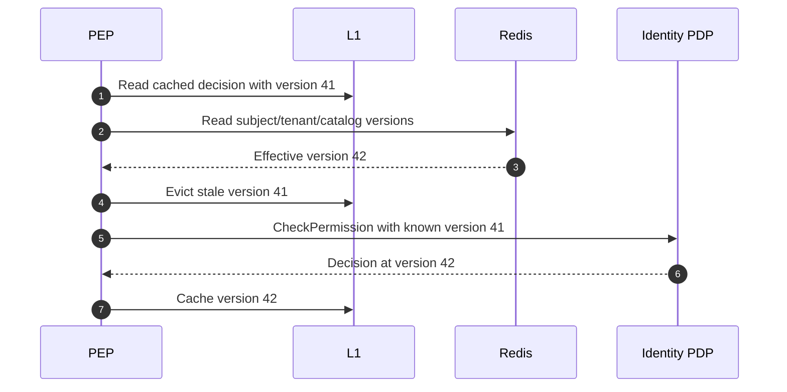
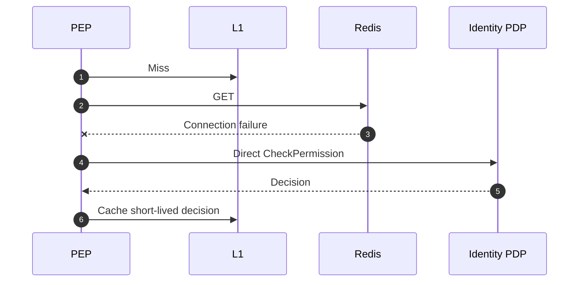
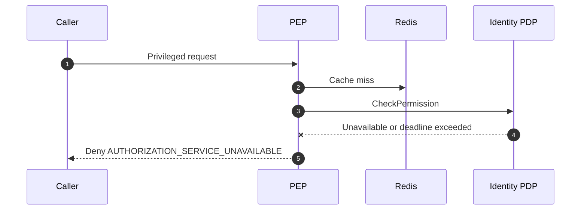

<!-- GENERATED BY generate_dynamic_authorization_design_docs.py; REVIEW-ONLY DESIGN -->

# 2. Sequence Diagrams

## 2.1 Normal authorization check with L1 hit

## 2.2 Authorization check with Redis and PDP fallback

## 2.3 Grant permission to role

## 2.4 Revoke permission from role

## 2.5 Assign or revoke a role for one subject

## 2.6 Create or update permission definition

## 2.7 Missed MQTT event recovery

## 2.8 Redis unavailable

## 2.9 Identity unavailable, fail closed

