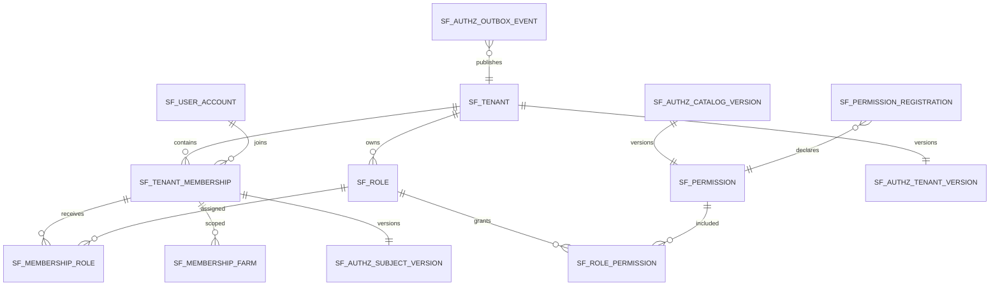

<!-- GENERATED BY generate_dynamic_authorization_design_docs.py; REVIEW-ONLY DESIGN -->

# 3. Database Design

## 3.1 Design principles

- PostgreSQL remains the authorization source of truth.
- Existing role and permission tables are retained.
- Versions are monotonic and updated in the same transaction as the authorization change.
- Outbox records are inserted in the same database transaction.
- Redis contains derived cache data only.
- Physical cache deletion is an optimization; version mismatch is the correctness mechanism.

## 3.2 Entity relationship diagram



## 3.3 Existing tables used by the PDP

```text
sf_user_account
sf_tenant
sf_tenant_membership
sf_role
sf_permission
sf_membership_role
sf_role_permission
sf_membership_farm
```

The PDP loads account, tenant, active membership, assigned roles, effective permission codes, and resource scope.

## 3.4 Proposed version tables

### Global catalog version

```sql
CREATE TABLE sf_authz_catalog_version (
    singleton_id SMALLINT PRIMARY KEY CHECK (singleton_id = 1),
    version BIGINT NOT NULL,
    updated_at TIMESTAMPTZ NOT NULL,
    updated_by VARCHAR(100),
    correlation_id VARCHAR(128)
);
```

There is exactly one row. It increments when permission metadata, namespace ownership, or policy interpretation changes.

### Tenant authorization version

```sql
CREATE TABLE sf_authz_tenant_version (
    tenant_id VARCHAR(36) PRIMARY KEY,
    version BIGINT NOT NULL,
    updated_at TIMESTAMPTZ NOT NULL,
    updated_by VARCHAR(100),
    correlation_id VARCHAR(128),
    CONSTRAINT fk_authz_tenant_version_tenant
        FOREIGN KEY (tenant_id) REFERENCES sf_tenant(id)
);
```

Increment for:

- grant/revoke permission on a tenant role;
- role-wide policy change;
- tenant enabled/disabled;
- tenant-wide invalidation.

### Subject authorization version

```sql
CREATE TABLE sf_authz_subject_version (
    tenant_id VARCHAR(36) NOT NULL,
    subject_id VARCHAR(36) NOT NULL,
    version BIGINT NOT NULL,
    updated_at TIMESTAMPTZ NOT NULL,
    updated_by VARCHAR(100),
    correlation_id VARCHAR(128),
    PRIMARY KEY (tenant_id, subject_id),
    CONSTRAINT fk_authz_subject_version_membership
        FOREIGN KEY (tenant_id, subject_id)
        REFERENCES sf_tenant_membership(tenant_id, user_id)
);
```

If the existing membership table does not expose a compatible unique key, reference `membership_id` instead and retain a unique index on `(tenant_id, subject_id)`.

Increment for:

- assign/revoke role;
- membership state change;
- farm/resource scope change;
- user account state change affecting authorization;
- subject-specific emergency invalidation.

## 3.5 Permission registration tables

```sql
CREATE TABLE sf_permission_namespace (
    namespace VARCHAR(80) PRIMARY KEY,
    owner_service VARCHAR(120) NOT NULL,
    enabled BOOLEAN NOT NULL DEFAULT TRUE,
    created_at TIMESTAMPTZ NOT NULL,
    updated_at TIMESTAMPTZ NOT NULL
);

CREATE TABLE sf_permission_registration (
    owner_service VARCHAR(120) NOT NULL,
    service_version VARCHAR(80) NOT NULL,
    namespace VARCHAR(80) NOT NULL,
    descriptor_checksum VARCHAR(64) NOT NULL,
    registered_at TIMESTAMPTZ NOT NULL,
    permission_count INTEGER NOT NULL,
    PRIMARY KEY (owner_service, namespace),
    CONSTRAINT fk_permission_registration_namespace
        FOREIGN KEY (namespace) REFERENCES sf_permission_namespace(namespace)
);
```

`sf_permission.code` remains the canonical permission key. Registration only manages metadata and ownership. It never grants roles.

Recommended additions to `sf_permission`:

```sql
ALTER TABLE sf_permission
    ADD COLUMN owner_service VARCHAR(120),
    ADD COLUMN namespace VARCHAR(80),
    ADD COLUMN active BOOLEAN NOT NULL DEFAULT TRUE,
    ADD COLUMN definition_version BIGINT NOT NULL DEFAULT 1;
```

Do not automatically delete a permission when a service stops declaring it. Mark it inactive after an explicit retirement workflow and verify that no role grant depends on it.

## 3.6 Authorization outbox

```sql
CREATE TABLE sf_authz_outbox_event (
    event_id VARCHAR(36) PRIMARY KEY,
    event_type VARCHAR(80) NOT NULL,
    aggregate_type VARCHAR(40) NOT NULL,
    aggregate_id VARCHAR(120) NOT NULL,
    aggregate_version BIGINT NOT NULL,
    tenant_id VARCHAR(36),
    subject_id VARCHAR(36),
    role_id VARCHAR(36),
    permission_code VARCHAR(80),
    catalog_version BIGINT NOT NULL,
    tenant_version BIGINT NOT NULL,
    subject_version BIGINT NOT NULL,
    correlation_id VARCHAR(128),
    actor_id VARCHAR(100),
    topic VARCHAR(255) NOT NULL,
    payload BYTEA NOT NULL,
    status VARCHAR(20) NOT NULL,
    attempt_count INTEGER NOT NULL DEFAULT 0,
    next_attempt_at TIMESTAMPTZ NOT NULL,
    claimed_by VARCHAR(100),
    claimed_at TIMESTAMPTZ,
    published_at TIMESTAMPTZ,
    last_error TEXT,
    created_at TIMESTAMPTZ NOT NULL
);

CREATE INDEX ix_authz_outbox_dispatch
    ON sf_authz_outbox_event(status, next_attempt_at, created_at);

CREATE INDEX ix_authz_outbox_tenant_subject
    ON sf_authz_outbox_event(tenant_id, subject_id, created_at);
```

Suggested status values:

```text
PENDING
PUBLISHING
PUBLISHED
FAILED
DEAD
```

## 3.7 Optional audit table

```sql
CREATE TABLE sf_authorization_decision_audit (
    decision_id VARCHAR(36) PRIMARY KEY,
    occurred_at TIMESTAMPTZ NOT NULL,
    tenant_id VARCHAR(36) NOT NULL,
    subject_id VARCHAR(100) NOT NULL,
    client_id VARCHAR(100),
    permission_code VARCHAR(80) NOT NULL,
    resource_type VARCHAR(80),
    resource_id VARCHAR(160),
    allowed BOOLEAN NOT NULL,
    reason_code VARCHAR(80) NOT NULL,
    catalog_version BIGINT NOT NULL,
    tenant_version BIGINT NOT NULL,
    subject_version BIGINT NOT NULL,
    correlation_id VARCHAR(128),
    source_service VARCHAR(120) NOT NULL,
    latency_ms INTEGER NOT NULL
);
```

Do not synchronously persist every allow decision in the initial rollout. Prefer metrics and sampled audit. Always audit administrative denials, wildcard allows, cross-tenant attempts, and policy errors.

## 3.8 Transactional version increment

Example role grant transaction:

```sql
BEGIN;

INSERT INTO sf_role_permission(role_id, permission_code)
VALUES (:roleId, :permissionCode)
ON CONFLICT DO NOTHING;

INSERT INTO sf_authz_tenant_version(tenant_id, version, updated_at)
VALUES (:tenantId, 1, now())
ON CONFLICT (tenant_id)
DO UPDATE SET version = sf_authz_tenant_version.version + 1,
              updated_at = now();

INSERT INTO sf_authz_outbox_event (...)
VALUES (...);

COMMIT;
```

The response must return the new version committed by this transaction.

## 3.9 Concurrency

- Version increments use atomic `UPDATE ... version = version + 1` or optimistic locking.
- Outbox aggregate versions must be monotonic.
- Grant/revoke operations remain idempotent.
- Registration uses namespace ownership plus checksum for idempotency.
- PDP snapshot reads should use one read-only transaction to avoid mixing role and version states.
