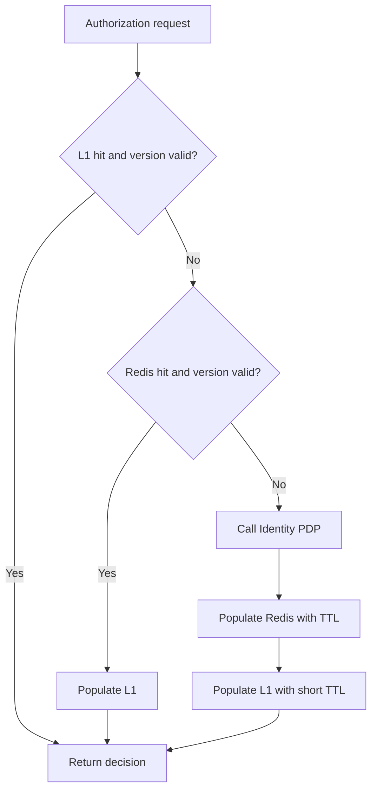

<!-- GENERATED BY generate_dynamic_authorization_design_docs.py; REVIEW-ONLY DESIGN -->

# 5. Cache, Versioning, MQTT, and Outbox

## 5.1 Cache layers



## 5.2 Version tuple

Every decision is associated with:

```text
catalogVersion
tenantVersion
subjectVersion
policyVersion
```

Effective cache identity:

```text
catalogVersion:tenantVersion:subjectVersion:policyVersion
```

`policyVersion` identifies the evaluator implementation or ruleset schema. It prevents a deployment with changed decision semantics from reusing incompatible entries.

## 5.3 Redis keys

Version keys:

```text
sf:authz:v1:catalog-version
sf:authz:v1:tenant-version:{tenantId}
sf:authz:v1:subject-version:{tenantId}:{subjectId}
```

Snapshot key:

```text
sf:authz:v1:snapshot:{tenantId}:{subjectId}:{catalogV}:{tenantV}:{subjectV}:{policyV}
```

Decision key:

```text
sf:authz:v1:decision:{tenantId}:{subjectId}:{catalogV}:{tenantV}:{subjectV}:{policyV}:{permissionHash}:{resourceHash}
```

Event deduplication:

```text
sf:authz:v1:event:{consumerName}:{eventId}
```

Do not clear Redis with `KEYS`. Old keys expire naturally and become unreachable when versions change.

## 5.4 TTL defaults

Proposed defaults:

```text
L1 allow decision:       30 seconds
L1 deny decision:        10 seconds
Redis allow decision:     5 minutes
Redis deny decision:     30 seconds
Redis user snapshot:      5 minutes
Version marker:          30 minutes
Event deduplication:       7 days
```

Add random TTL jitter of up to 10 percent to reduce synchronized expiry.

## 5.5 Cache key resource fingerprint

Create a deterministic hash from normalized fields:

```text
resourceType
resourceId
farmId
sorted bounded attributes
```

Never place raw sensitive values in Redis key names.

## 5.6 Single-flight

Within one process, concurrent misses for the same decision key share one loader execution. Redis distributed locks are not required initially because duplicate read-only PDP calls are safe. Add a short distributed lock only if observed load justifies it.

## 5.7 Invalidation event topics

Domain event:

```text
smartfarm/{tenantId}/identity/domain/authorization-invalidated/v1
```

Global catalog event:

```text
smartfarm/_global/identity/domain/authorization-catalog-invalidated/v1
```

Retained version state:

```text
smartfarm/{tenantId}/identity/state/authorization-version/v1
smartfarm/_global/identity/state/authorization-catalog-version/v1
```

Policy:

```text
Domain invalidation event: QoS 1, retained false
Version state event:       QoS 1, retained true
Persistent subscriber:     clean session false
```

## 5.8 Event handling

### Subject invalidation

```text
Update local subject version.
Evict L1 entries for tenant and subject.
Record event deduplication marker.
```

### Tenant invalidation

```text
Update local tenant version.
Evict tenant L1 entries.
Do not scan/delete all Redis decisions.
```

### Catalog invalidation

```text
Update catalog version.
Clear local catalog and decision L1 caches.
Reload permission descriptors only when needed.
```

### Global invalidation

```text
Increment generation/version.
Clear local caches.
Do not use wildcard Redis deletion.
```

## 5.9 Consistency hierarchy

Correctness does not depend on MQTT delivery:

```text
Database version     = source of truth
Redis version        = shared fast marker
MQTT event           = fast local invalidation
TTL                   = final cleanup bound
```

A subscriber that misses MQTT detects the new version before reusing the stale decision.

## 5.10 Outbox behavior

- Insert event in the same transaction as the authorization mutation.
- Relay claims with skip-locked batch processing.
- Publish protobuf event to MQTT with QoS 1.
- Mark published only after broker acknowledgement.
- Retry with bounded exponential backoff.
- Move exhausted events to `DEAD` for operator recovery.
- Consumer handling is idempotent by event ID.
