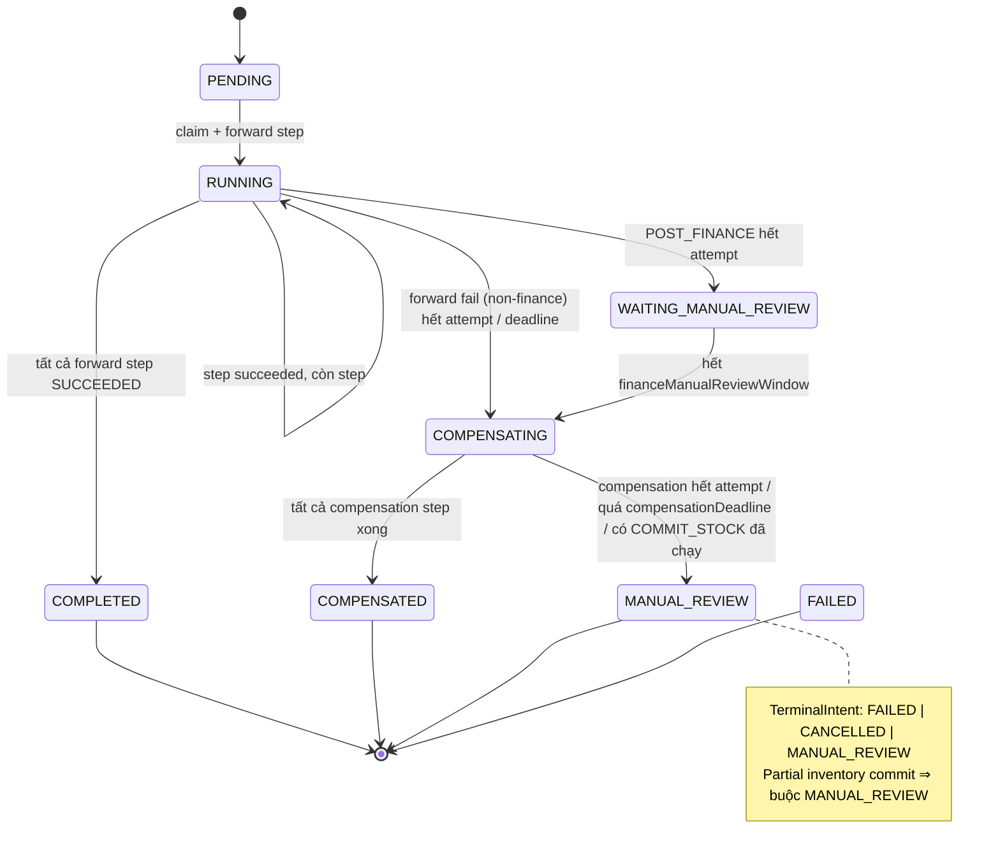
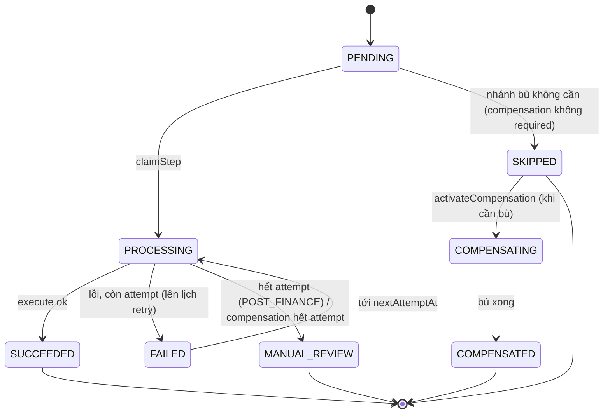
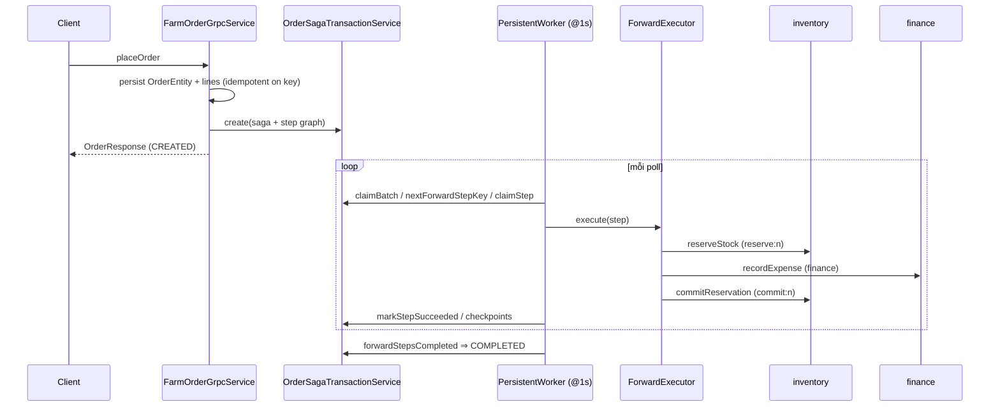
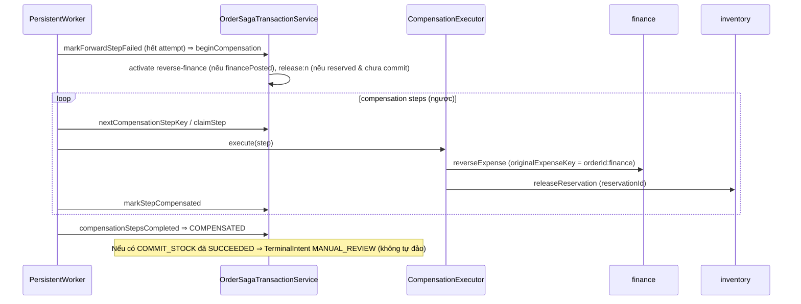

# Order Saga — Architecture & Contract

> Tài liệu kiến trúc saga đang CHẠY của order-service, sau khi gỡ dead-path
> `OrderSagaOrchestrator` (ISSUE-03/08). Mục tiêu: người mới hiểu saga mà không phải đọc hết source.
> Nguồn: đọc source trực tiếp. Khớp với implementation tại thời điểm cleanup.

## 1. Owner & Participants

- **Saga owner (duy nhất):** order-service — cơ chế **persistent-worker** (DB-backed).
- **Participants (single-step, idempotent, không phải saga owner):**
  - inventory-service — `reserveStock` / `commitReservation` / `releaseReservation`.
  - finance-service — `recordExpense` / `reverseExpense`.
- **Không service nào khác sở hữu saga.** (⇒ chưa tách `smartfarm-saga`, xem `docs/audit/08`.)

## 2. Thành phần (3 lớp)

| Lớp | Class | Trách nhiệm |
|---|---|---|
| Business Workflow | `OrderSagaStepType`, `OrderSagaForwardStepExecutor`, `OrderSagaCompensationStepExecutor` | Step reserve→finance→commit / reverse-finance→release; gọi gRPC inventory/finance |
| Saga Runtime | `OrderSagaPersistentWorker` (poll+claim loop @1s), `OrderSagaTransactionService` (transition/lock/retry), `OrderSagaCheckpointService` | Claim, poll, retry, checkpoint, deadline, transition |
| Saga Infrastructure | `OrderSagaEntity`, `OrderSagaStepEntity`, repos, `OrderSagaProperties`, `OrderSagaHealthIndicator`, `OrderSagaAdministration*` | Persistence, locking, config, metrics, admin recovery |

Ranh giới (cố ý **không** generic hóa): step types + executors + graph + manual-review policy là
business của order, không đưa vào common.

## 3. Forward steps (graph dựng khi tạo saga)

`OrderSagaTransactionService.graph()`:
```text
reserve:<lineNo> × N   (RESERVE_STOCK)   → inventory.reserveStock
finance                (POST_FINANCE)    → finance.recordExpense
commit:<lineNo> × N    (COMMIT_STOCK)    → inventory.commitReservation
--- nhánh bù dựng sẵn, kích hoạt khi compensate ---
reverse-finance        (REVERSE_FINANCE) → finance.reverseExpense
release:<lineNo> × N   (RELEASE_STOCK, thứ tự ngược) → inventory.releaseReservation
```

## 4. Idempotency key matrix (BẮT BUỘC — contract)

Mỗi step: `idempotencyKey = orderId + ":" + stepKey` (dựng tại `graph()`), gửi trong `RequestContext`.

| Operation | Step key | Forward idempotency key | Compensation reference key | Participant |
|---|---|---|---|---|
| RESERVE_STOCK | `reserve:<n>` | `orderId:reserve:<n>` | — | inventory |
| POST_FINANCE | `finance` | **`orderId:finance`** | — | finance |
| COMMIT_STOCK | `commit:<n>` | `orderId:commit:<n>` | — | inventory |
| REVERSE_FINANCE | `reverse-finance` | — | **originalExpenseKey = `orderId:finance`**, reversalKey = `orderId:reverse-finance` | finance |
| RELEASE_STOCK | `release:<n>` | — | `orderId:release:<n>` (releaseReservation theo reservationId) | inventory |

> **Invariant xác nhận:** `REVERSE_FINANCE` tham chiếu `originalExpenseKey = orderId:finance` —
> KHỚP với forward `POST_FINANCE = orderId:finance` (`OrderSagaCompensationStepExecutor.reverseFinance`
> dòng 59). Đường chết cũ dùng `:expense` đã bị gỡ bỏ.

## 5. Transaction boundaries (invariant)

- Executor gọi gRPC remote **ngoài** `@Transactional`.
- `OrderSagaTransactionService.*` (claim/mark/transition) là `@Transactional` + row-lock `findByIdForUpdate`.
- ⇒ **Không giữ DB transaction trong lúc gọi remote gRPC.**

## 6. Retry / Deadline / Claim (OrderSagaProperties, prefix `smartfarm.order.saga`)

| Property | Default | Vai trò |
|---|---|---|
| `enabled` | — | bật worker (`@ConditionalOnProperty ...enabled=true`) |
| `batchSize` | 20 (cap 200) | số saga claim mỗi vòng |
| `maximumAttempts` | 5 | hết → manual review (finance) hoặc compensation (step khác) |
| `initialRetry` | 5s | backoff mũ: `initial*2^(attempt-1)` |
| `maximumRetry` | 5m | trần backoff |
| `claimTimeout` | 2m | claim quá hạn → `recoverStaleClaims` |
| `processingDeadline` | 30m | quá hạn → compensation (FAILED) |
| `compensationDeadline` | 6h | quá hạn → manual review |
| `financeManualReviewWindow` | 60m | POST_FINANCE hết attempt → chờ review trong cửa sổ này |

## 7. Saga state machine


Terminal: `COMPLETED, COMPENSATED, FAILED, MANUAL_REVIEW`. Claimable: `PENDING, RUNNING, COMPENSATING`.

## 8. Step state machine


Terminal: `SUCCEEDED, COMPENSATED, SKIPPED, MANUAL_REVIEW`.

## 9. Happy path (sequence)



## 10. Compensation (sequence)



## 11. Claim / recovery

- `recoverStaleClaims()` mỗi vòng: saga RUNNING/COMPENSATING quá `claimTimeout` → `recover`, reset step.
- `expireManualReviewsAndProcessingDeadlines()`: review hết cửa sổ / processing quá deadline → compensation.
- Admin: `OrderSagaAdministrationService/Controller` + `OrderSagaAdministrationGrpcService` cho thao tác phục hồi thủ công; audit `OrderSagaRecoveryAuditEntity`.

## 12. Outbox / event

- Saga tiến → `OrderEventStore.append*` (business event) → bảng outbox → `OrderOutboxRelay @Scheduled` publish MQTT.
- Outbox **tách biệt** saga (không trộn transaction). Projection read-model + gap-recovery riêng.

## 13. Metrics & health

- `OrderSagaHealthIndicator` (Spring Actuator health).
- `OrderOperationalMetrics` (counters saga/step). Sau cleanup không còn metric nào mang tên inline orchestrator.

## 14. Cố ý KHÔNG generic hóa (ranh giới trích xuất tương lai)

`OrderSagaStepType`, forward/compensation executors (gọi inventory/finance stub), `graph()`,
manual-review policy, `OrderEntity`/`OrderStatus` mapping. Chỉ trích xuất khi có saga owner thứ 2
(xem backlog `SAGA-EN2` trong `docs/audit/08`).
