# Project Structure Baseline

> Generated at `2026-10-08T11:18:48+07:00`. Source-derived inventory before Saga/platform refactoring.

## Git snapshot

- Branch: `main`
- Commit: `e61433ac79ebc9a790f1779a4aef91c00a9e4594`
- Working tree: `has local changes`
- Indexed: `802`; recalculated: `802`; cached: `0`

## Initial project tree

```text
.
├── .github
│   └── workflows
│       └── build-push.yml
├── .kiro
│   └── settings
│       └── cli.json
├── Dockerfile
├── README.md
├── SECURITY.md
├── apps
│   ├── smartfarm-gateway
│   │   ├── README.md
│   │   ├── pom.xml
│   │   └── src
│   │       └── main
│   │           ├── java
│   │           │   └── com
│   │           └── resources
│   │               ├── application-dev.yml
│   │               ├── application-prod.yml
│   │               └── application.yml
│   └── smartfarm-web
│       ├── README.md
│       ├── index.html
│       ├── package-lock.json
│       ├── package.json
│       ├── src
│       │   ├── App.tsx
│       │   ├── components
│       │   │   ├── Layout.tsx
│       │   │   ├── RequireScope.tsx
│       │   │   ├── TotpEnroll.tsx
│       │   │   └── ui.tsx
│       │   ├── index.css
│       │   ├── lib
│       │   │   ├── api.ts
│       │   │   ├── auth.tsx
│       │   │   ├── farm.tsx
│       │   │   └── recent.ts
│       │   ├── main.tsx
│       │   └── pages
│       │       ├── AuthShell.tsx
│       │       ├── Bootstrap.tsx
│       │       ├── Dashboard.tsx
│       │       ├── Inventory.tsx
│       │       ├── Livestock.tsx
│       │       ├── Login.tsx
│       │       ├── OrderDetail.tsx
│       │       ├── OrderNew.tsx
│       │       ├── Orders.tsx
│       │       ├── Profile.tsx
│       │       ├── Reports.tsx
│       │       └── admin
│       │           └── Users.tsx
│       ├── tsconfig.json
│       └── vite.config.ts
├── backlog
│   ├── IMPLEMENTATION-ORDER.md
│   ├── NO-REWORK-STRATEGY.md
│   ├── README.md
│   ├── SERVICE-OWNERSHIP.md
│   ├── V1-Core-Platform
│   │   ├── 00-README.md
│   │   ├── 01-foundation-identity-security.md
│   │   ├── 02-farm-spatial.md
│   │   ├── 03-inventory-work.md
│   │   ├── 04-livestock-health-finance-reporting.md
│   │   ├── 05-iot-foundation.md
│   │   └── 06-gate.md
│   ├── V2-Warehouse-Operations
│   │   ├── 00-README.md
│   │   ├── 01-storage-location.md
│   │   ├── 02-qr-location.md
│   │   ├── 03-inventory-classification.md
│   │   ├── 04-warehouse-workflow.md
│   │   └── 05-gate.md
│   ├── V3-Connected-Farm
│   │   ├── 00-README.md
│   │   ├── 01-device-registry.md
│   │   ├── 02-mqtt-telemetry.md
│   │   ├── 03-environment-rules.md
│   │   ├── 04-actuator-control.md
│   │   ├── 05-sensor-simulator.md
│   │   ├── 06-safety-observability.md
│   │   └── 07-e2e.md
│   ├── WHAT-WAS-REMOVED.md
│   └── v0.1
│       ├── README.md
│       └── V0.1-001-test-profile-security-config.md
├── bruno
│   ├── 01 - identity
│   │   ├── 00 - bootstrap-superadmin.bru
│   │   ├── 01 - login.bru
│   │   ├── 02 - mfa-enrollment-begin.bru
│   │   ├── 03 - mfa-enrollment-confirm.bru
│   │   ├── 04 - login (after enrollment).bru
│   │   ├── 05 - mfa-verify.bru
│   │   ├── 06 - whoami (me).bru
│   │   ├── 07 - refresh token.bru
│   │   ├── 08 - logout.bru
│   │   ├── 09 - deployment-state (public).bru
│   │   └── folder.bru
│   ├── 02 - gateway-graphql
│   │   ├── 01 - introspection.bru
│   │   ├── 02 - platformStatus.bru
│   │   ├── 03 - me.bru
│   │   └── folder.bru
│   ├── 03 - inventory
│   │   ├── 01 - create item.bru
│   │   ├── 02 - receive stock.bru
│   │   └── folder.bru
│   ├── 04 - order
│   │   ├── 01 - create draft order.bru
│   │   ├── 02 - submit draft order.bru
│   │   ├── 03 - get order.bru
│   │   ├── 04 - list orders.bru
│   │   ├── 05 - cancel order.bru
│   │   └── folder.bru
│   ├── 05 - livestock
│   │   ├── 01 - register animal.bru
│   │   ├── 02 - list animals.bru
│   │   ├── 03 - create task.bru
│   │   └── folder.bru
│   ├── 06 - reporting
│   │   ├── 01 - request export.bru
│   │   ├── 02 - get export job.bru
│   │   ├── 03 - get download location.bru
│   │   └── folder.bru
│   ├── README.md
│   ├── bruno.json
│   ├── collection.bru
│   └── environments
│       └── local.bru
├── collect_smartfarm_baseline.py
├── compose.yaml
├── deploy
│   └── kubernetes
│       ├── README.md
│       └── order-gateway.yaml
├── docs
│   ├── 07-runtime-readiness.md
│   ├── 10-implementation-roadmap.md
│   ├── 11-task-dependency-graph.md
│   ├── PROJECT-STATUS.md
│   ├── api
│   │   ├── events.md
│   │   ├── grpc-api.md
│   │   └── rest-api.md
│   ├── architecture
│   │   ├── gateway-mapping.md
│   │   ├── order-saga.md
│   │   ├── request-flows.md
│   │   ├── service-communications.md
│   │   └── system-overview.md
│   ├── audit
│   │   ├── 00-executive-summary.md
│   │   ├── 01-architecture-graph-report.md
│   │   ├── 02-event-flow-report.md
│   │   ├── 03-business-workflow-report.md
│   │   ├── 04-issue-register.md
│   │   ├── 05-improvement-register.md
│   │   ├── 06-remediation-plan.md
│   │   ├── 07-shared-kernel-refactoring-review.md
│   │   ├── 08-saga-dead-path-and-framework-assessment.md
│   │   ├── _AUDIT_BRIEF.md
│   │   ├── audit-progress.md
│   │   ├── documentation-audit.md
│   │   ├── graphify
│   │   │   ├── findings.md
│   │   │   └── snapshot-v0.md
│   │   ├── outstanding-issues.md
│   │   ├── removed-or-archived-files.md
│   │   ├── repository-manifest.md
│   │   └── unresolved-items.md
│   ├── cleanup
│   │   ├── 00-executive-summary.md
│   │   ├── 01-backlog-version-consolidation.md
│   │   ├── 02-module-maturity-register-part2.md
│   │   ├── 02-module-maturity-register.md
│   │   ├── 03-backlog-implementation-traceability.md
│   │   ├── 04-gateway-contract-coverage.md
│   │   ├── 05-identity-security-conformance.md
│   │   ├── 06-cleanup-register.md
│   │   ├── 07-execution-plan.md
│   │   ├── 08-script-register.md
│   │   ├── 09-documentation-config-sync.md
│   │   ├── 10-mqtt-production-readiness.md
│   │   ├── 11-verification-result.md
│   │   ├── 12-final-project-state.md
│   │   ├── chunks
│   │   │   ├── CHUNK-01-summary.md
│   │   │   ├── CHUNK-02-summary.md
│   │   │   ├── CHUNK-03-summary.md
│   │   │   ├── CHUNK-04-summary.md
│   │   │   ├── CHUNK-05-summary.md
│   │   │   ├── CHUNK-06-summary.md
│   │   │   ├── CHUNK-07-summary.md
│   │   │   ├── CHUNK-08-summary.md
│   │   │   ├── CHUNK-09-summary.md
│   │   │   ├── CHUNK-10-summary.md
│   │   │   ├── CHUNK-11-summary.md
│   │   │   ├── CHUNK-12-summary.md
│   │   │   └── CHUNK-13-summary.md
│   │   └── tools
│   │       └── graphslice.py
│   ├── history
│   │   ├── deprecated-documentation.md
│   │   └── resolved-issues.md
│   ├── index.md
│   ├── operations
│   │   ├── ORDER-OPERATIONS-RUNBOOK.md
│   │   ├── ORDER-PRODUCTION-ACCEPTANCE.md
│   │   ├── ORDER-SLO.md
│   │   ├── configuration.md
│   │   ├── deployment.md
│   │   ├── local-development.md
│   │   ├── observability.md
│   │   └── troubleshooting.md
│   ├── refactor
│   │   ├── DB-OWNERSHIP.md
│   │   └── DEV-DB-WORKFLOW.md
│   ├── remediation
│   │   ├── ISSUE-03-execution-result.md
│   │   └── ISSUE-04-05-execution-result.md
│   ├── roadmap.md
│   ├── runbooks
│   │   └── prod-super-admin-bootstrap.md
│   ├── security
│   │   ├── mqtt-acl-mtls.md
│   │   ├── security-architecture.md
│   │   └── threat-model.md
│   └── services
│       ├── finance.md
│       ├── gateway.md
│       ├── health.md
│       ├── identity.md
│       ├── inventory.md
│       ├── livestock.md
│       ├── order.md
│       └── reporting.md
├── infra
│   └── mosquitto.conf
├── libs
│   ├── smartfarm-common-kernel
│   │   ├── pom.xml
│   │   └── src
│   │       ├── main
│   │       │   └── java
│   │       │       └── com
│   │       └── test
│   │           └── java
│   │               └── com
│   ├── smartfarm-messaging
│   │   ├── pom.xml
│   │   └── src
│   │       ├── main
│   │       │   └── java
│   │       │       └── com
│   │       └── test
│   │           └── java
│   │               └── com
│   ├── smartfarm-proto
│   │   ├── README.md
│   │   ├── pom.xml
│   │   └── src
│   │       └── main
│   │           └── proto
│   │               └── smartfarm
│   └── smartfarm-security
│       ├── pom.xml
│       └── src
│           ├── main
│           │   └── java
│           │       └── com
│           └── test
│               └── java
│                   └── com
├── observability
│   ├── docker-compose.monitoring.yml
│   ├── grafana
│   │   ├── dashboards
│   │   │   └── smartfarm-order-operations.json
│   │   └── provisioning
│   │       ├── dashboards
│   │       │   └── order.yml
│   │       └── datasources
│   │           └── prometheus.yml
│   └── prometheus
│       ├── order-alerts.yml
│       └── prometheus.yml
├── platform
│   ├── smartfarm-farm-simulator
│   │   ├── pom.xml
│   │   └── src
│   │       └── main
│   │           ├── java
│   │           │   └── com
│   │           └── resources
│   │               └── application.yml
│   └── smartfarm-readiness-service
│       ├── pom.xml
│       └── src
│           └── main
│               ├── java
│               │   └── com
│               └── resources
│                   ├── application-dev.yml
│                   ├── application-prod.yml
│                   └── application.yml
├── pom.xml
├── scripts
│   ├── README.md
│   ├── bootstrap.sh
│   ├── build-all.sh
│   ├── config-forward.sh
│   ├── dev
│   │   └── rebuild-restart.sh
│   ├── doctor.sh
│   ├── graphql
│   │   ├── gateway
│   │   │   └── test-graphql.sh
│   │   ├── test-all-graphql.sh
│   │   ├── test-introspection.sh
│   │   └── test-schema.sh
│   ├── health
│   │   └── test-health.sh
│   ├── legacy
│   │   ├── README.md
│   │   ├── curl-06-cancel-completed.sh
│   │   ├── curl-07-multiline.sh
│   │   ├── livestock-lifecycle-test.sh
│   │   ├── livestock-registry-test.sh
│   │   ├── phase2-curl-test.sh
│   │   └── phase3-saga-curl-test.sh
│   ├── lib
│   │   ├── assertions.sh
│   │   ├── auth.sh
│   │   ├── common.sh
│   │   └── http.sh
│   ├── release
│   │   ├── production
│   │   │   └── validate-order-release.sh
│   │   └── v1
│   │       ├── 00-preflight.sh
│   │       ├── 10-auth-rbac.sh
│   │       ├── 20-livestock-flow.sh
│   │       ├── 30-order-saga.sh
│   │       ├── 40-reporting.sh
│   │       ├── 50-reporting-render.sh
│   │       ├── 60-graphql.sh
│   │       ├── _lib.sh
│   │       └── run-all.sh
│   ├── rest
│   │   ├── identity
│   │   │   └── test-rest.sh
│   │   ├── inventory
│   │   │   └── test-rest.sh
│   │   ├── livestock
│   │   │   └── test-rest.sh
│   │   ├── order
│   │   │   └── test-rest.sh
│   │   ├── reporting
│   │   │   └── test-rest.sh
│   │   └── test-all-rest.sh
│   ├── run-all.sh
│   └── smoke
│       └── smoke-test.sh
└── services
    ├── smartfarm-finance-service
    │   ├── pom.xml
    │   └── src
    │       ├── main
    │       │   ├── java
    │       │   │   └── com
    │       │   └── resources
    │       │       ├── application-dev.yml
    │       │       ├── application-prod.yml
    │       │       ├── application-test.yml
    │       │       ├── application.yml
    │       │       └── db
    │       └── test
    │           └── java
    │               └── com
    ├── smartfarm-health-service
    │   ├── pom.xml
    │   └── src
    │       ├── main
    │       │   ├── java
    │       │   │   └── com
    │       │   └── resources
    │       │       ├── application-dev.yml
    │       │       ├── application-prod.yml
    │       │       ├── application-test.yml
    │       │       ├── application.yml
    │       │       └── db
    │       └── test
    │           └── java
    │               └── com
    ├── smartfarm-identity-service
    │   ├── README.md
    │   ├── pom.xml
    │   ├── scripts
    │   │   ├── generate-dev-keys.sh
    │   │   ├── generate-dev-tls.sh
    │   │   └── rand.sh
    │   └── src
    │       ├── main
    │       │   ├── java
    │       │   │   └── com
    │       │   └── resources
    │       │       ├── application-dev-tls.yml
    │       │       ├── application-dev.yml
    │       │       ├── application-prod.yml
    │       │       ├── application-test.yml
    │       │       ├── application.yml
    │       │       └── db
    │       └── test
    │           └── java
    │               └── com
    ├── smartfarm-inventory-service
    │   ├── pom.xml
    │   └── src
    │       ├── main
    │       │   ├── java
    │       │   │   └── com
    │       │   └── resources
    │       │       ├── application-dev.yml
    │       │       ├── application-prod.yml
    │       │       ├── application-test.yml
    │       │       ├── application.yml
    │       │       └── db
    │       └── test
    │           └── java
    │               └── com
    ├── smartfarm-livestock-service
    │   ├── pom.xml
    │   └── src
    │       ├── main
    │       │   ├── java
    │       │   │   └── com
    │       │   └── resources
    │       │       ├── application-dev.yml
    │       │       ├── application-prod.yml
    │       │       ├── application-test.yml
    │       │       ├── application.yml
    │       │       └── db
    │       └── test
    │           └── java
    │               └── com
    ├── smartfarm-order-service
    │   ├── pom.xml
    │   └── src
    │       ├── main
    │       │   ├── java
    │       │   │   └── com
    │       │   └── resources
    │       │       ├── application-dev.yml
    │       │       ├── application-prod.yml
    │       │       ├── application-test.yml
    │       │       ├── application.yml
    │       │       └── db
    │       └── test
    │           └── java
    │               └── com
    └── smartfarm-reporting-service
        ├── pom.xml
        └── src
            ├── main
            │   ├── java
            │   │   └── com
            │   └── resources
            │       ├── application-dev.yml
            │       ├── application-prod.yml
            │       ├── application-test.yml
            │       ├── application.yml
            │       └── db
            └── test
                └── java
                    └── com
```

## Candidate services

| Service/module | Files | Status |
|---|---:|---|
| `finance` | 1 | Needs verification |
| `finance.md` | 1 | Needs verification |
| `gateway` | 1 | Needs verification |
| `gateway.md` | 1 | Needs verification |
| `health.md` | 1 | Needs verification |
| `identity` | 2 | Needs verification |
| `identity.md` | 1 | Needs verification |
| `inventory` | 2 | Needs verification |
| `inventory.md` | 1 | Needs verification |
| `livestock.md` | 1 | Needs verification |
| `order` | 2 | Needs verification |
| `order.md` | 1 | Needs verification |
| `reporting.md` | 1 | Needs verification |
| `smartfarm-finance-service` | 17 | Needs verification |
| `smartfarm-gateway` | 43 | Needs verification |
| `smartfarm-health-service` | 25 | Needs verification |
| `smartfarm-identity-service` | 166 | Needs verification |
| `smartfarm-inventory-service` | 32 | Needs verification |
| `smartfarm-livestock-service` | 31 | Needs verification |
| `smartfarm-order-service` | 128 | Needs verification |
| `smartfarm-readiness-service` | 11 | Needs verification |
| `smartfarm-reporting-service` | 23 | Needs verification |
| `smartfarm-web` | 29 | Needs verification |

## Initial service view

```mermaid
flowchart LR
    finance["finance"]:::unknown
    finance_md["finance.md"]:::unknown
    gateway["gateway"]:::unknown
    gateway_md["gateway.md"]:::unknown
    health_md["health.md"]:::unknown
    identity["identity"]:::unknown
    identity_md["identity.md"]:::unknown
    inventory["inventory"]:::unknown
    inventory_md["inventory.md"]:::unknown
    livestock_md["livestock.md"]:::unknown
    order["order"]:::unknown
    order_md["order.md"]:::unknown
    reporting_md["reporting.md"]:::unknown
    smartfarm_finance_service["smartfarm-finance-service"]:::unknown
    smartfarm_gateway["smartfarm-gateway"]:::unknown
    smartfarm_health_service["smartfarm-health-service"]:::unknown
    smartfarm_identity_service["smartfarm-identity-service"]:::unknown
    smartfarm_inventory_service["smartfarm-inventory-service"]:::unknown
    smartfarm_livestock_service["smartfarm-livestock-service"]:::unknown
    smartfarm_order_service["smartfarm-order-service"]:::unknown
    smartfarm_readiness_service["smartfarm-readiness-service"]:::unknown
    smartfarm_reporting_service["smartfarm-reporting-service"]:::unknown
    smartfarm_web["smartfarm-web"]:::unknown
    classDef unknown fill:#f3f4f6,color:#374151,stroke:#6b7280
```



> Runtime edges are intentionally not inferred from filenames alone. Verify clients, stubs, routes, listeners and deployment configuration.

## Refactoring comparison checklist

- [ ] Map Saga forward and compensation steps.
- [ ] Verify idempotency, retry, timeout, Outbox/Inbox and reconciliation.
- [ ] Update common proto and Gateway implementation when gRPC contracts change.
- [ ] Update Bruno collections for changed business APIs.
- [ ] Update `apps/smartfarm-web` API clients, types and screens.
- [ ] Add target architecture and after-refactoring comparison.
