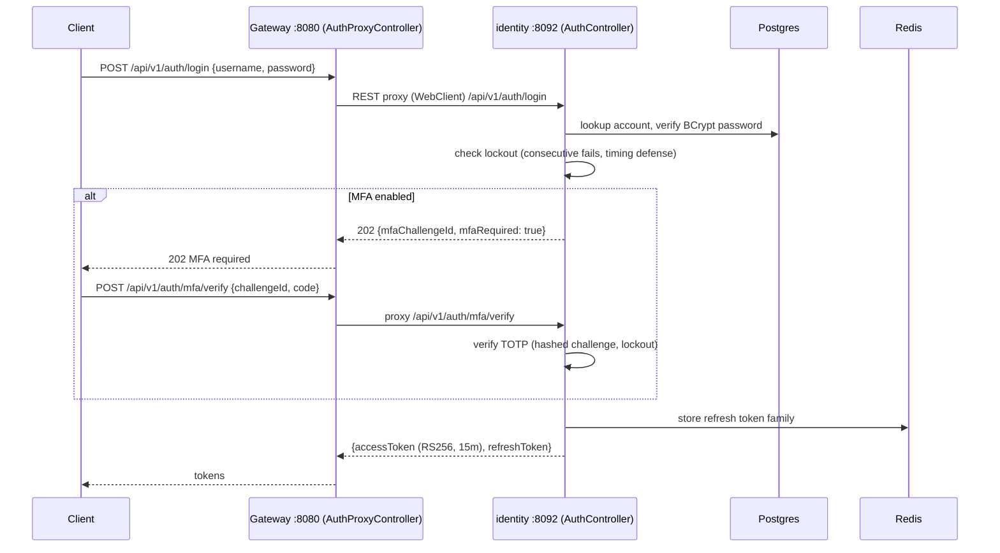
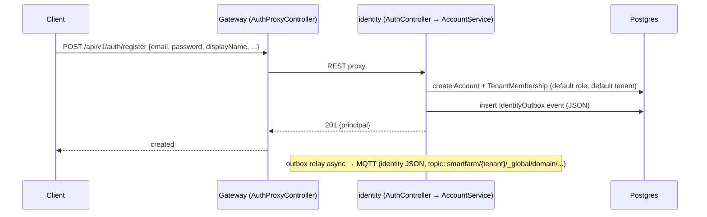
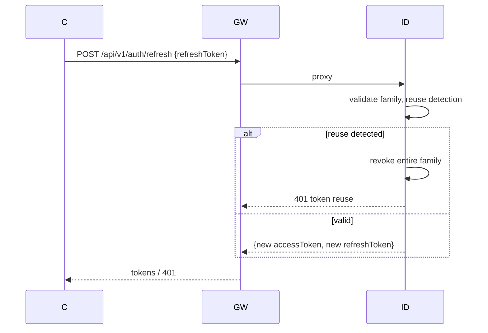
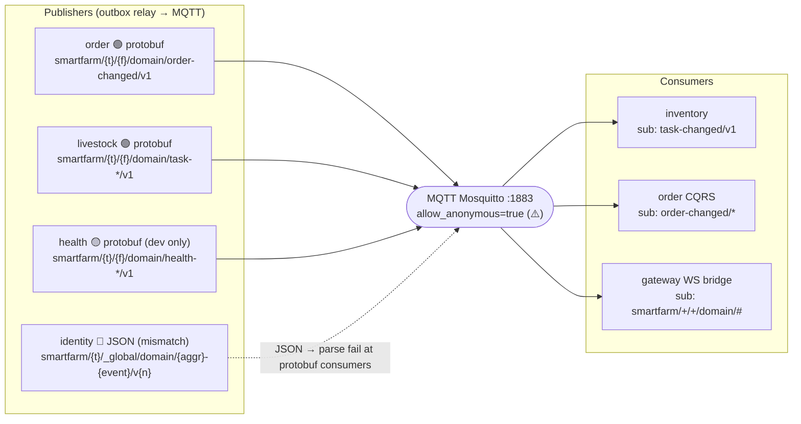

# Request Flows — SmartFarm Platform

> Verified from source @ HEAD `eaaa112`. Chỉ vẽ flow có **lời gọi thực tế trong source** — không vẽ dependency suy đoán.

## 1. Login



**Thành phần đã hoàn thiện**: proxy, credential verify, lockout, MFA TOTP, rotating refresh, RS256 JWT (JWKS endpoint).
**Thiếu**: rate limiting cho auth endpoint (không phát hiện trong source).

## 2. Registration



🟡 Lưu ý: event identity = **JSON** (không phải protobuf DomainEvent) → WS bridge gateway parse-fail.

## 3. Token refresh



🟢 Rotating refresh + family reuse detection verified in `AuthService`.

## 4. PlaceOrder — cross-service saga (gateway → order → inventory + finance)

```mermaid
sequenceDiagram
  participant C as Client
  participant GW as Gateway (OrderRestController)
  participant ORD as order :9095 (FarmOrderGrpcService)
  participant SAGA as order saga worker (persistent, scheduled)
  participant INV as inventory :9093
  participant FIN as finance :9094
  participant MQTT as MQTT broker
  participant CQRS as order read-model (OrderChangedConsumer)
  
  C->>GW: POST /api/v1/orders {Idempotency-Key, farmId, lines}
  Note over GW: @PreAuthorize SCOPE_orders:write; JWT→gRPC context
  GW->>ORD: gRPC PlaceOrder
  ORD->>ORD: persist Order (CREATED) + SagaExecution
  ORD-->>GW: Order(view)
  GW-->>C: 200 OK

  rect rgb(30,60,30)
    Note over SAGA: async saga worker (scheduler-claimed)
    SAGA->>INV: gRPC reserveStock(lines)
    alt reserve OK
      SAGA->>FIN: gRPC recordExpense
      alt finance OK
        SAGA->>INV: gRPC commitReservation
        SAGA->>SAGA: mark COMPLETED
      else finance FAIL
        SAGA->>INV: gRPC releaseReservation
        SAGA->>FIN: gRPC reverseExpense
        SAGA->>SAGA: mark FAILED (compensation)
      end
    else reserve FAIL
      SAGA->>SAGA: mark FAILED
    end
    SAGA->>ORD: persist outbox event (OrderChanged)
  end

  ORD-. outbox relay .->MQTT: protobuf DomainEvent
  MQTT->>CQRS: OrderChangedConsumer (CQRS read-model)
  MQTT->>GW: WS bridge → browser push
```

🟢 5 saga gRPC calls verified. Idempotency key required. Outbox at-least-once. CQRS projection + gap-recovery.
**Failure path**: compensation (release reservation + reverse expense). Deadlines: 5s default configurable.

## 5. gRPC flow — livestock task lifecycle (gateway → livestock → outbox → inventory subscriber)

```mermaid
sequenceDiagram
  participant GW as Gateway (LivestockDevController, dev-only)
  participant LIV as livestock :9091 (LivestockGrpcService)
  participant MQTT as MQTT
  participant INV as inventory (TaskMqttSubscriber)

  GW->>LIV: gRPC CreateTask / AssignTask / CompleteTask ...
  LIV->>LIV: domain logic + persist outbox event
  LIV-. outbox relay .->MQTT: smartfarm/{tenant}/{farm}/domain/task-changed/v1
  MQTT->>INV: subscribe task-changed/v1 only
  Note over INV: Inventory chỉ sub topic task-changed; 6 leaf lifecycle khác (assigned/accepted/completed/cancelled) → chỉ WS bridge nhận
```

🟡 dev-only. inventory chỉ lắng nghe `task-changed/v1` — phạm vi hẹp.

## 6. MQTT event-driven (general event communication)



**Verified issues**: payload mismatch (identity JSON), topic schema inconsistency (identity vs others), WS bridge expects protobuf, health dev-only publisher.

← [System Overview](./system-overview.md) · [Gateway Mapping](./gateway-mapping.md) · [Documentation Index](../index.md)
