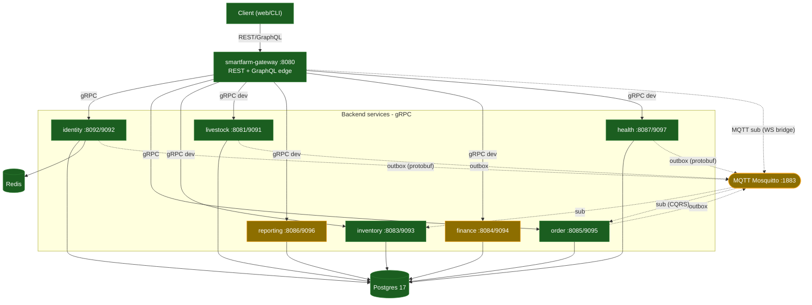
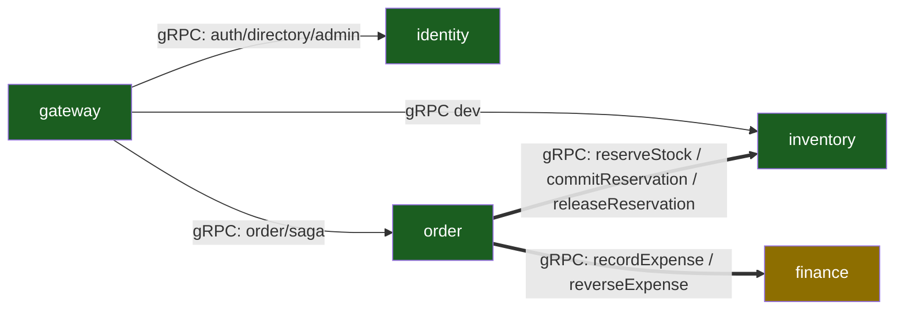
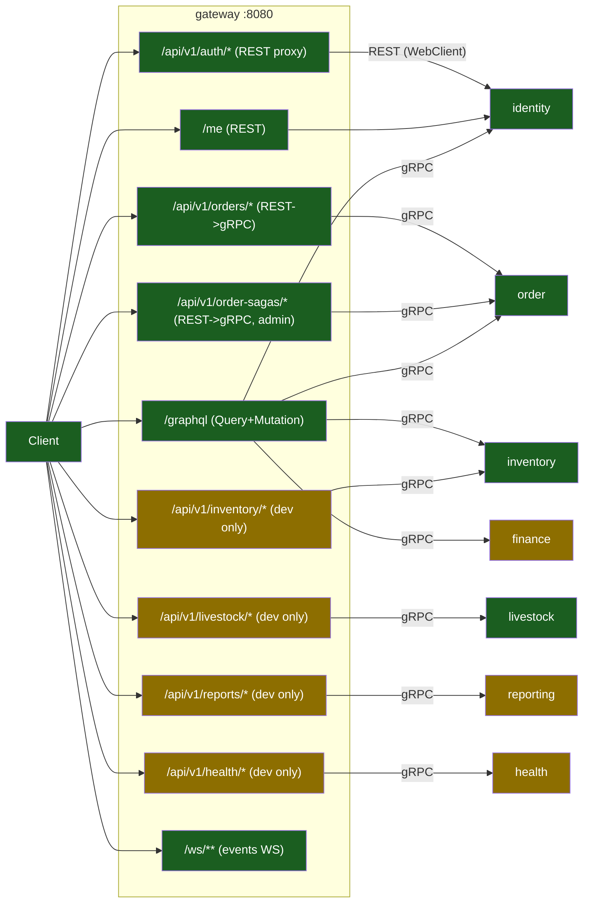
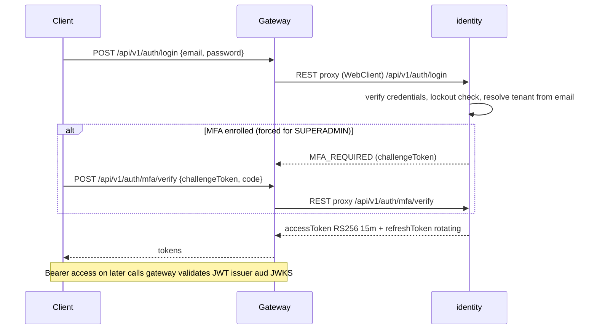
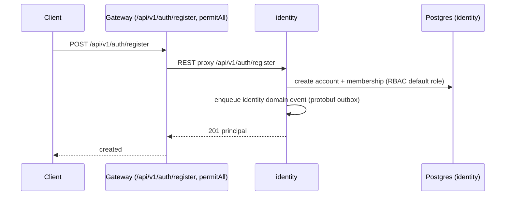
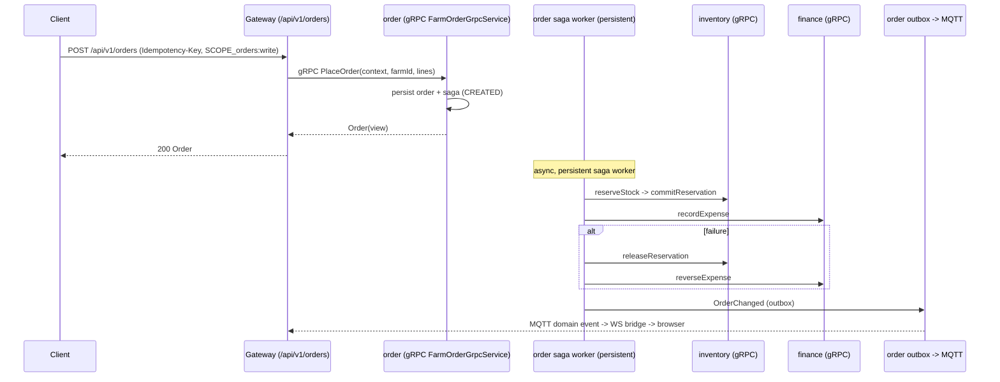
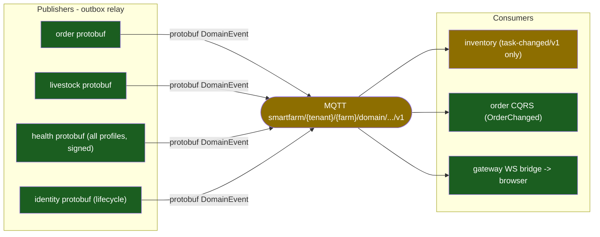

# System Overview — SmartFarm Platform

> Verified from source @ HEAD `f113657` (updated 2026-10-07). Màu: 🟢 verified-implemented · 🟡 partial · 🔴 missing/not-mapped · ⬜ planned.
> Mỗi service node liên kết tới `docs/services/<name>.md`.

## 1. Kiến trúc tổng thể

Monorepo Maven 14 module. **Edge** = `smartfarm-gateway` (Spring WebFlux reactive, :8080): nhận REST + GraphQL từ client, dịch sang **gRPC** gọi các service nội bộ. Giao tiếp sự kiện qua **MQTT** (Mosquitto :1883) theo outbox/inbox. Mỗi service có Postgres riêng (TEST/PROD) hoặc dùng chung `smartfarm` (dev).

- **Đồng bộ**: REST (client↔gateway, gateway↔identity auth), gRPC (gateway↔services, order↔inventory/finance).
- **Bất đồng bộ**: MQTT domain events (outbox relay → broker → consumer/WS bridge).

## 2. System context

🟢 **health-service** giờ đã nối vào gateway: dev REST facade `/api/v1/health/*` (observations/vaccinations/alerts) qua gRPC client `AnimalHealthService` (GW-01 fixed). 🟡 **finance** chỉ lộ 2 GraphQL dev-only.

## 3. Service dependency graph

Dependency xuyên service **thực tế có trong source**: `order → inventory` (3 RPC saga), `order → finance` (2 RPC saga). Không có `identity → order`. Livestock/reporting/health **không** là downstream của service khác (chỉ nhận gRPC từ gateway và/hoặc publish event).

## 4. Gateway routing overview

Chi tiết từng route: [`docs/architecture/gateway-mapping.md`](./gateway-mapping.md).

## 5. Authentication flow (login)

🟢 Verified @ `f113657`: login nhận **email + password** (bỏ `tenantId` bắt buộc; nhiều tenant → `TENANT_SELECTION_REQUIRED`). `AuthProxyController` (gateway) proxy sang `AuthController` (identity) qua WebClient; JWT RS256 15 phút + JWKS + audience/tenant validation (`libs/smartfarm-security`). SUPERADMIN bị ép TOTP → login trả `MFA_REQUIRED` trước khi cấp token.

## 6. Registration flow

🟢 identity publish event dạng **protobuf `DomainEvent`** (payload `IdentityLifecycleEvent`), cùng format mọi service khác → event identity tới được WS bridge của gateway (EVT-01/02 đã fix, xem §8).

## 7. Request flow xuyên service — PlaceOrder saga (REST → gRPC → saga → inventory + finance)

🟢 Verified: 5 cross-service gRPC saga calls tồn tại trong source; outbox at-least-once + CQRS projection; failure path = compensation (release/reverse).

## 8. Event communication overview

🔐 **MQTT message auth (HMAC-SHA256 signed envelope)** đã wired vào **mọi** publisher (`sign`) và consumer (`verify`) qua `libs/smartfarm-security` (`MqttSecurityVerifier` + self-describing `SFM1` frame). `dev`: bật sẵn (sign+verify ON, shared dev secret). `prod`: default OFF, bật theo rollout 2 pha (sign-all → verify-all) — chi tiết [`mqtt-acl-mtls.md`](../security/mqtt-acl-mtls.md). Broker-level ACL + mTLS vẫn là sample config (chưa enable).

**Vấn đề đã xác minh** (chi tiết [`request-flows.md`](./request-flows.md) + [`unresolved-items.md`](../audit/unresolved-items.md)):
- ✅ **EVT-01 (RESOLVED)**: identity giờ emit **protobuf `DomainEvent`** (payload `IdentityLifecycleEvent`, oneof field 24) → WS bridge parse được. Trước đây emit JSON nên bị drop.
- ✅ **EVT-02 (RESOLVED)**: identity topic chuẩn hoá về `smartfarm/{tenant}/_global/domain/{event}/v1` (bỏ segment `{aggr}-{event}`), khớp filter `smartfarm/+/+/domain/#`.
- 🟡 inventory chỉ sub `task-changed/v1`; 6 leaf lifecycle livestock khác chỉ WS bridge nhận.
- 🟢 health publisher giờ active mọi profile (gated `smartfarm.health.outbox.enabled`), ký HMAC, nhận broker cấu hình → **đã có đường event health ở prod** (EVT-03 fixed, Option A).

---

## Service docs
- [gateway](../services/gateway.md) · [identity](../services/identity.md) · [order](../services/order.md) · [inventory](../services/inventory.md) · [finance](../services/finance.md) · [livestock](../services/livestock.md) · [health](../services/health.md) · [reporting](../services/reporting.md)
- ← [Documentation Index](../index.md)
