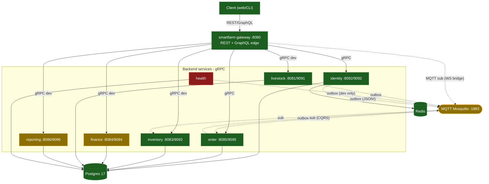
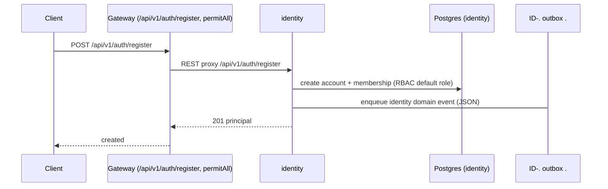

# System Overview — SmartFarm Platform

> Verified from source @ HEAD `eaaa112`. Màu: 🟢 verified-implemented · 🟡 partial · 🔴 missing/not-mapped · ⬜ planned.
> Mỗi service node liên kết tới `docs/services/<name>.md`.

## 1. Kiến trúc tổng thể

Monorepo Maven 14 module. **Edge** = `smartfarm-gateway` (Spring WebFlux reactive, :8080): nhận REST + GraphQL từ client, dịch sang **gRPC** gọi các service nội bộ. Giao tiếp sự kiện qua **MQTT** (Mosquitto :1883) theo outbox/inbox. Mỗi service có Postgres riêng (TEST/PROD) hoặc dùng chung `smartfarm` (dev).

- **Đồng bộ**: REST (client↔gateway, gateway↔identity auth), gRPC (gateway↔services, order↔inventory/finance).
- **Bất đồng bộ**: MQTT domain events (outbox relay → broker → consumer/WS bridge).

## 2. System context



🔴 **health-service** không có bất kỳ đường gateway nào (không REST, không GraphQL, không khai báo gRPC client trong gateway `application.yml`). 🟡 **finance** chỉ lộ 2 GraphQL dev-only.

## 3. Service dependency graph

```mermaid
flowchart LR
  gw["gateway"]:::ok
  id["identity"]:::ok
  ord["order"]:::ok
  inv["inventory"]:::ok
  fin["finance"]:::partial
  gw -->|"gRPC: auth/directory/admin"| id
  gw -->|"gRPC: order/saga"| ord
  gw -->|"gRPC dev"| inv
  ord ==>|"gRPC: reserveStock / commitReservation / releaseReservation"| inv
  ord ==>|"gRPC: recordExpense / reverseExpense"| fin
  classDef ok fill:#1b5e20,color:#fff; classDef partial fill:#8d6e00,color:#fff;
```

Dependency xuyên service **thực tế có trong source**: `order → inventory` (3 RPC saga), `order → finance` (2 RPC saga). Không có `identity → order`. Livestock/reporting/health **không** là downstream của service khác (chỉ nhận gRPC từ gateway và/hoặc publish event).

## 4. Gateway routing overview

```mermaid
flowchart LR
  c["Client"]:::ok
  subgraph gw["gateway :8080"]
    auth["/api/v1/auth/* (REST proxy)"]:::ok
    me["/me (REST)"]:::ok
    ords["/api/v1/orders/* (REST→gRPC)"]:::ok
    saga["/api/v1/order-sagas/* (REST→gRPC, admin)"]:::ok
    gql["/graphql (Query+Mutation)"]:::ok
    livd["/api/v1/livestock/* (dev only)"]:::partial
    invd["/api/v1/inventory/* (dev only)"]:::partial
    repd["/api/v1/reports/* (dev only)"]:::partial
    ws["/ws/** (events WS)"]:::ok
  end
  c --> auth & me & ords & saga & gql & livd & invd & repd & ws
  auth -->|"REST (WebClient)"| id["identity"]:::ok
  me --> id
  ords & saga -->|gRPC| ord["order"]:::ok
  gql -->|gRPC| id & ord & inv["inventory"]:::ok & fin["finance"]:::partial
  livd -->|gRPC| liv["livestock"]:::ok
  invd -->|gRPC| inv
  repd -->|gRPC| rep["reporting"]:::partial
  classDef ok fill:#1b5e20,color:#fff; classDef partial fill:#8d6e00,color:#fff;
```

Chi tiết từng route: [`docs/architecture/gateway-mapping.md`](./gateway-mapping.md).

## 5. Authentication flow (login)

```mermaid
sequenceDiagram
  participant C as Client
  participant GW as Gateway (/api/v1/auth/login)
  participant ID as identity (REST AuthController)
  C->>GW: POST /api/v1/auth/login {username,password}
  GW->>ID: REST proxy (WebClient) /api/v1/auth/login
  ID->>ID: verify credentials, lockout check, (MFA challenge if enabled)
  ID-->>GW: {accessToken (RS256, 15m), refreshToken (rotating)}
  GW-->>C: tokens
  Note over C,GW: Subsequent calls: Authorization: Bearer <access>; gateway validates JWT (issuer/aud/JWKS)
```

🟢 Verified: `AuthProxyController` (gateway) proxy sang `AuthController` (identity) qua WebClient; JWT RS256 cap 15 phút + JWKS + audience/tenant validation (`libs/smartfarm-security`).

## 6. Registration flow



🟡 Lưu ý: identity publish event dạng **JSON** (khác protobuf của các service khác) → event identity không tới được WS bridge của gateway (xem §8, ISSUE event-payload).

## 7. Request flow xuyên service — PlaceOrder saga (REST → gRPC → saga → inventory + finance)

```mermaid
sequenceDiagram
  participant C as Client
  participant GW as Gateway (/api/v1/orders)
  participant ORD as order (gRPC FarmOrderGrpcService)
  participant SAGA as order saga worker (persistent)
  participant INV as inventory (gRPC)
  participant FIN as finance (gRPC)
  participant OB as order outbox → MQTT
  C->>GW: POST /api/v1/orders (Idempotency-Key, SCOPE_orders:write)
  GW->>ORD: gRPC PlaceOrder(context, farmId, lines)
  ORD->>ORD: persist order + saga (CREATED)
  ORD-->>GW: Order(view)
  GW-->>C: 200 Order
  Note over SAGA: async, persistent saga worker
  SAGA->>INV: reserveStock → commitReservation
  SAGA->>FIN: recordExpense
  alt failure
    SAGA->>INV: releaseReservation
    SAGA->>FIN: reverseExpense
  end
  SAGA-. OrderChanged .->OB
  OB-->>GW: MQTT domain event → WS bridge → browser
```

🟢 Verified: 5 cross-service gRPC saga calls tồn tại trong source; outbox at-least-once + CQRS projection; failure path = compensation (release/reverse).

## 8. Event communication overview

```mermaid
flowchart LR
  subgraph pub[Publishers - outbox relay]
    ord["order 🟢 protobuf"]:::ok
    liv["livestock 🟢 protobuf"]:::ok
    hea["health 🟡 protobuf (dev only, loopback-only)"]:::partial
    id["identity 🔴 JSON (mismatch)"]:::missing
  end
  broker(["MQTT smartfarm/{tenant}/{farm}/domain/.../v1"]):::partial
  subgraph sub[Consumers]
    inv["inventory (task-changed/v1 only)"]:::partial
    ordc["order CQRS (OrderChanged)"]:::ok
    wsb["gateway WS bridge → browser"]:::ok
  end
  ord & liv & hea -->|protobuf DomainEvent| broker
  id -.->|JSON ≠ protobuf| broker
  broker --> inv & ordc & wsb
  classDef ok fill:#1b5e20,color:#fff; classDef partial fill:#8d6e00,color:#fff; classDef missing fill:#8e1b1b,color:#fff;
```

**Vấn đề đã xác minh** (chi tiết [`request-flows.md`](./request-flows.md) + [`unresolved-items.md`](../audit/unresolved-items.md)):
- 🔴 **Payload mismatch**: identity emit JSON; gateway WS bridge parse protobuf → event identity rớt.
- 🟡 **Topic mismatch**: identity dùng `smartfarm/{tenant}/_global/domain/{aggr}-{event}/v{n}` (không có farm segment, nối hyphen) vs chuẩn `.../{farm}/domain/.../v1`.
- 🟡 inventory chỉ sub `task-changed/v1`; 6 leaf lifecycle livestock khác chỉ WS bridge nhận.
- 🟡 health publisher dev-only + từ chối broker non-loopback → **không có đường event health ở prod**.

---

## Service docs
- [gateway](../services/gateway.md) · [identity](../services/identity.md) · [order](../services/order.md) · [inventory](../services/inventory.md) · [finance](../services/finance.md) · [livestock](../services/livestock.md) · [health](../services/health.md) · [reporting](../services/reporting.md)
- ← [Documentation Index](../index.md)
