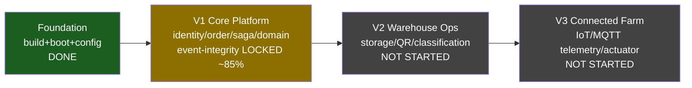

# Roadmap — SmartFarm Platform

> Verified @ HEAD (updated 2026-10-07, post EVT-01/02 + ISSUE-02 + GW-01 + EVT-03 + ISSUE-06). Versioning theo backlog hiện có: V1 Core Platform / V2 Warehouse / V3 Connected Farm. Checklist: `[x]` done+evidence · `[ ]` chưa · `[~]` partial · `[?]` needs-verification.

## Milestone map

**Hiện tại: cuối Foundation / giữa V1 (~85%).** Build+boot+config đã ổn định (profile fix, security key fix). Core domain + saga + security hoàn chỉnh; event-integrity đã khoá (HMAC + protobuf, live-verified) và gateway đã nối health. Còn lại: finance prod path (GW-02), inventory AdjustStock/TraceLot, broker ACL/mTLS bật thật, prodize các facade dev-only.

## V0 — Foundation (✅ DONE)
- **Mục tiêu**: build → boot → config nhất quán.
- [x] 14 module reactor build (bằng chứng: reactor pom; **chưa chạy build lần này** — Maven không có PATH, `[?]` cho log)
- [x] Profile mặc định `dev` + env override (commit `eaaa112`)
- [x] Security key nested fix (ISSUE-01, CFG-01 resolved)
- **Điều kiện chuyển V1**: service boot được ở dev. ✅

## V1 — Core Platform (`~` IN PROGRESS)
- **Mục tiêu**: identity + order saga + domain services chạy end-to-end qua gateway, có event-bus an toàn.
- [x] Identity auth/MFA/RBAC + gRPC (verified source)
- [x] Order persistent saga + outbox + CQRS (verified)
- [x] inventory/finance saga integration (5 cross-service RPC)
- [x] gateway REST+GraphQL edge
- [x] MQTT event bus: identity → protobuf `DomainEvent` (EVT-01) + topic schema chuẩn (EVT-02), live-verified qua WS bridge
- [x] MQTT security: HMAC `SFM1` app-level ký+verify, live-verified 5/5 enforcement control (ISSUE-02). Broker auth/TLS/ACL vẫn sample-only (chưa bật — ISSUE-15/16)
- [x] health service: nối gateway qua dev REST facade (GW-01) + prod event path all-profile signed (EVT-03). Còn 6/10 RPC chưa impl
- [x] identity `command.result`: reclassified by-design, command-ack qua WS (ISSUE-06)
- [~] finance/reporting: expose prod còn thiếu (GW-02)
- [~] inventory: AdjustStock/TraceLot chưa impl
- [ ] broker hardening: allow_anonymous=false + ACL + TLS bật thật (ISSUE-15/16)
- [ ] gRPC TLS prod
- [?] Build/test xanh toàn reactor (health 5/5 + gateway compile xanh lần này; chưa chạy full suite)
- **Rủi ro còn lại**: finance orphan prod (GW-02), inventory RPC thiếu, broker chưa hardened ở prod.
- **Điều kiện hoàn thành V1**: xem `backlog/V1-Core-Platform/06-gate.md`.

## V2 — Warehouse Operations (NOT STARTED)
- **Phạm vi**: storage location, QR, inventory classification, warehouse workflow. Backlog: `backlog/V2-Warehouse-Operations/`.
- Dependency: V1 inventory ổn định (AdjustStock/TraceLot).
- [ ] toàn bộ. Gate: `V2-.../05-gate.md`.

## V3 — Connected Farm (NOT STARTED)
- **Phạm vi**: device registry, MQTT telemetry, environment rules, actuator control, sensor simulator, safety/observability, E2E. Backlog: `backlog/V3-Connected-Farm/`.
- Dependency: `farm.proto` + `telemetry.proto` (hiện chưa impl), MQTT security (ISSUE-02).
- [ ] toàn bộ.

## TODO checklist còn hiệu lực (cross-version)
- [x] EVT-01/02: identity event → protobuf DomainEvent + topic chuẩn (live-verified)
- [x] GW-01: route gateway cho health (dev REST facade)
- [x] EVT-03: health prod event path (all-profile signed publisher)
- [x] ISSUE-02: MQTT HMAC ký+verify app-level (live-verified); broker hardening còn OPEN (ISSUE-15/16)
- [x] ISSUE-06: command.result reclassified by-design (command-ack WS)
- [x] DOC-01: sửa README broken link
- [ ] GW-02: finance prod path (REST/GraphQL prod)
- [ ] inventory AdjustStock/TraceLot impl
- [ ] broker allow_anonymous=false + ACL + mTLS bật thật (ISSUE-15/16)
- [ ] gRPC TLS prod, observability/SLO alerting cluster-wide, K8s cho 5 service

← [Documentation Index](index.md) · [Implementation Roadmap chi tiết](10-implementation-roadmap.md) · [Task Dependency Graph](11-task-dependency-graph.md)
