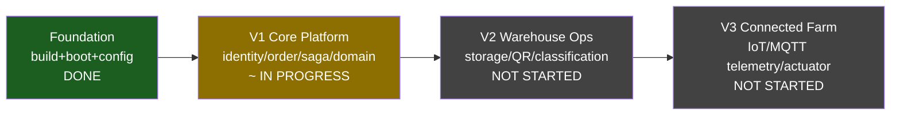

# Roadmap — SmartFarm Platform

> Verified @ HEAD `eaaa112`. Versioning theo backlog hiện có: V1 Core Platform / V2 Warehouse / V3 Connected Farm. Checklist: `[x]` done+evidence · `[ ]` chưa · `[~]` partial · `[?]` needs-verification.

## Milestone map

**Hiện tại: cuối Foundation / giữa V1.** Build+boot+config đã ổn định (profile fix, security key fix). Core domain + saga + security hoàn chỉnh; còn khoá event-integrity, gateway coverage (health/finance), prod-ize facade.

## V0 — Foundation (✅ DONE)
- **Mục tiêu**: build → boot → config nhất quán.
- [x] 14 module reactor build (bằng chứng: reactor pom; **chưa chạy build lần này** — Maven không có PATH, `[?]` cho log)
- [x] Profile mặc định `dev` + env override (commit `eaaa112`)
- [x] Security key nested fix (ISSUE-01, CFG-01 resolved)
- **Điều kiện chuyển V1**: service boot được ở dev. ✅

## V1 — Core Platform (`~` IN PROGRESS)
- **Mục tiêu**: identity + order saga + domain services chạy end-to-end qua gateway, có event-bus an toàn.
- [x] Identity auth/MFA/RBAC + gRPC (verified source)
- [x] Order persistent saga + outbox + CQRS (verified)
- [x] inventory/finance saga integration (5 cross-service RPC)
- [x] gateway REST+GraphQL edge
- [~] MQTT event bus: hoạt động nhưng **identity JSON mismatch** (EVT-01) + topic schema (EVT-02)
- [~] health service: 4/10 RPC + **orphan khỏi gateway** (GW-01, EVT-03)
- [~] finance/reporting: expose prod còn thiếu (GW-02)
- [~] inventory: AdjustStock/TraceLot chưa impl
- [ ] MQTT security: HMAC enable + broker auth/TLS/ACL (ISSUE-02)
- [ ] gRPC TLS prod
- [?] Build/test xanh (cần chạy Maven — chưa verify lần này)
- **Rủi ro**: event-integrity (ISSUE-02), payload mismatch, health orphan.
- **Điều kiện hoàn thành V1**: xem `backlog/V1-Core-Platform/06-gate.md`.

## V2 — Warehouse Operations (NOT STARTED)
- **Phạm vi**: storage location, QR, inventory classification, warehouse workflow. Backlog: `backlog/V2-Warehouse-Operations/`.
- Dependency: V1 inventory ổn định (AdjustStock/TraceLot).
- [ ] toàn bộ. Gate: `V2-.../05-gate.md`.

## V3 — Connected Farm (NOT STARTED)
- **Phạm vi**: device registry, MQTT telemetry, environment rules, actuator control, sensor simulator, safety/observability, E2E. Backlog: `backlog/V3-Connected-Farm/`.
- Dependency: `farm.proto` + `telemetry.proto` (hiện chưa impl), MQTT security (ISSUE-02).
- [ ] toàn bộ.

## TODO checklist còn hiệu lực (cross-version)
- [ ] EVT-01: identity event → protobuf DomainEvent
- [ ] GW-01: route gateway cho health
- [ ] ISSUE-02: MQTT HMAC + broker hardening
- [ ] DOC-01: sửa README broken link (xong trong đợt audit này)
- [ ] gRPC TLS, observability cluster-wide, K8s cho 5 service

← [Documentation Index](index.md) · [Implementation Roadmap chi tiết](10-implementation-roadmap.md) · [Task Dependency Graph](11-task-dependency-graph.md)
