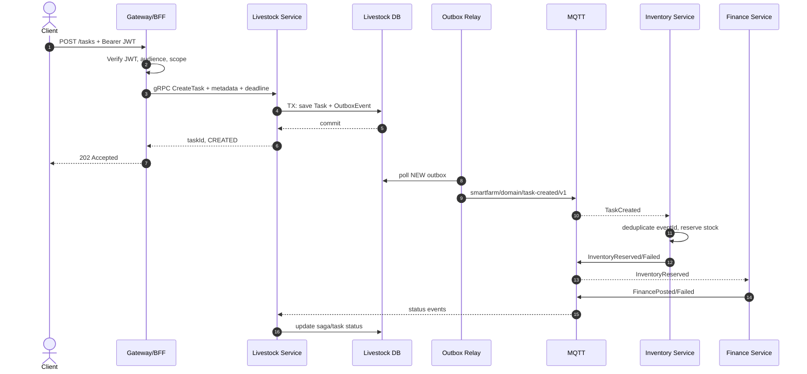
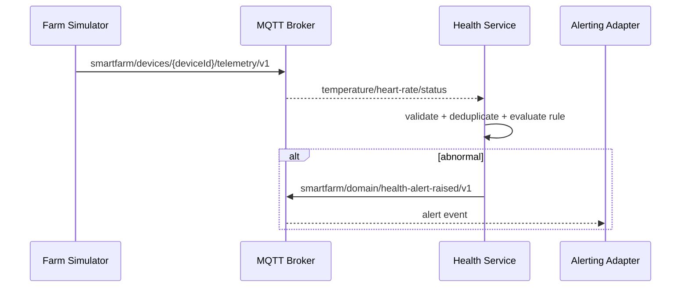
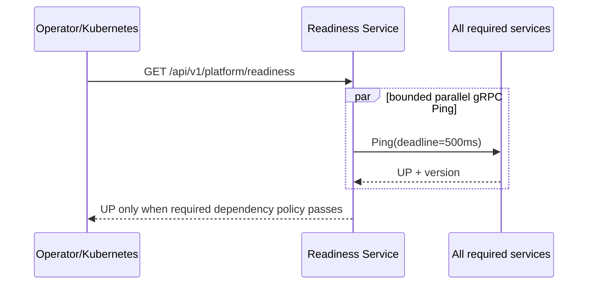

# Sequence tổng quát

## Command tạo nhiệm vụ và saga

> **Ghi chú khớp code v1 (order saga).** Sơ đồ trên minh hoạ mô hình *choreography* định hướng cho task lifecycle.
> Trong v1, **PlaceOrder saga đã cài đặt theo *orchestration đồng bộ*** bên trong `order-service`: order gọi lần lượt
> `Inventory.Reserve` → `Finance.RecordExpense` → `Inventory.Commit` qua **gRPC** (mỗi bước lỗi → compensation
> `release` + `reverseExpense`), rồi phát `OrderChanged` qua **outbox → MQTT** để dựng read-model CQRS
> (`ord_order_view`). Nghĩa là bước reserve/expense/commit là gRPC trực tiếp (không choreography qua MQTT); MQTT chỉ
> mang **event thông báo trạng thái** cho read-model và realtime. Chi tiết ở
> [docs/GATEWAY-API-V1.md §6](../v1/GATEWAY-API-V1.md#6-inventory--order-saga-apiv1).

## IoT simulator

## Readiness

